**ゼロから作るDeepLearning**
# 5章 誤差逆伝播法 1/2

多田 瑛貴
公立はこだて未来大学 システム情報科学部
複雑系知能学科 複雑系コース 2年

---

# 前章で学んだこと

 - 機械学習のデータセットは、訓練データとテストデータに分ける
   - 「汎化能力」を正しく評価するため
     - 訓練データに特化したらいけないよね、という話だった
 - ニューラルネットワークを用いた学習では、「損失関数」を指標とし、その値を小さくするようにパラメータを調整する
   - 「最小二乗法」とかの話もあったりとか
 - 微小な値を用いた微分の計算を「数値微分」という
   - 0.00..01 のような値を使って0の極限を表現
   - 数値微分は、実装が簡単だが、
   ニューラルネットワークでは計算効率が悪いらしいとか
---

# 今回学ぶこと

 - ニューラルネットワークの最適な（=損失関数の値が最小となる）
 重みパラメータの組み合わせを探すため、勾配法を適用したい
   - しかし、数値微分では計算に時間がかかる
   - そこで、「**誤差逆伝播法**」を使って高速に勾配を求める

 - 5章では、誤差逆伝播法を説明している
   - **本発表ではその理解に必要な概念「逆伝播」を理解する**
   - 書籍では「計算グラフ」を用いた説明がされている

---

# 「逆伝播」を理解する

---

# 5.1 計算グラフ

---

# 計算グラフ

- 計算の過程をグラフによって表現する
  - ノード○ に計算の内容、矢印→ に計算結果を書く

 > 例: 太郎くんはスーパーで1個100円のりんごを2個買った。支払う金額を求めよ。ただし、消費税は10%とする。

 - 計算グラフは以下のようになる

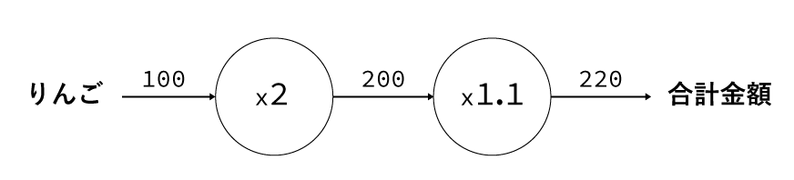

---

 - ノード○ 内の「2」や「1.1」も、入力として与えることにする
   - ノード○ 内は「x」や「+」だけになる （ =「乗算ノード」「加算ノード」）

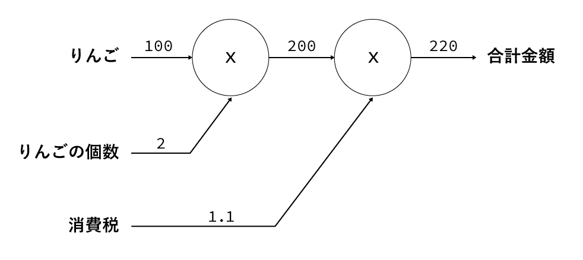

---

 - もっと複雑な過程も表現できる

 > 例: 太郎くんはスーパーでりんごを2個、みかんを3個買った。りんごは1個100円、みかんは1個150円である。消費税は10%とし、支払う金額を求めよ。

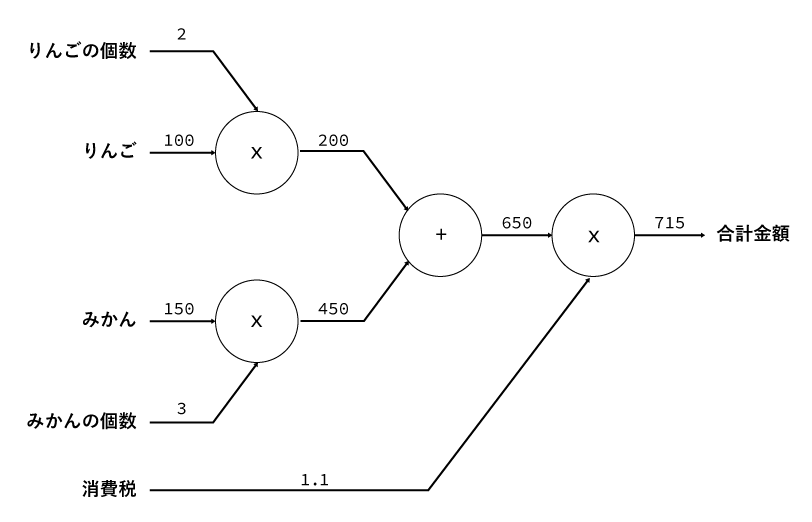

---

# 計算グラフによる計算の流れ

 - 計算グラフを使って問題を解くには、
   1. 計算グラフを構築する
   2. 計算グラフ上で計算を左から右へ進める
   という流れで行う
 - 左から右へ流れることを**順伝播**という
   - 右から左へ流れる**逆伝播**もある（重要）

---

# 計算グラフの特徴

 - 計算グラフは「局所的な計算」の連なりである
   - 各ノードは、自分に関係する情報だけで計算結果を出力している
     - 全体がどのように計算されているかは関係ない

---

# 計算グラフにおける「局所的な計算」

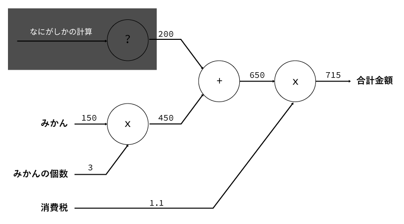

 - ブラックボックスな計算があっても、各ノードの計算には影響しない

---

# 計算グラフの特徴

 - 計算グラフは「局所的な計算」の連なり(伝播)である
 - メリット
   - 複雑な式を分割し、単純化できる
     - 今回の例でも、複雑な計算を、簡単な四則計算に分解している
   - 途中の計算結果を保持しておくことができる
 - 何が嬉しい？
   - 逆伝播によって**微分を求められる**
     
---

# 逆伝播のモチベーション
 - そもそも何がしたいんだっけ？
   - 与えられた関数の微分を求めたい（けど数値微分では遅い）
 - 例示の問題について
   - りんごの値段を$x$、支払金額を$L(x)$とすると
   - 求める微分は$\frac{\partial L(x)}{\partial x}$
     - 普通に求めると、$L(x) = x\times 2\times 1.1$ より $\frac{\partial L(x)}{\partial x} = 2.2$

 > 太郎くんはスーパーで1個 $x$円のりんごを2個買った。支払う金額を求めよ。ただし、消費税は10%とする。

---

 - **これは、逆伝播でも求められる**

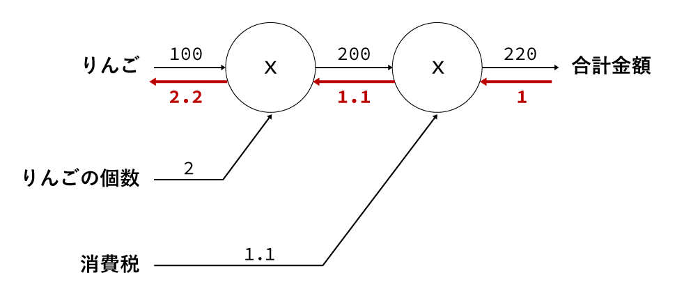

---

# 逆伝播のモチベーション

**微分が求められそう!**

注目すべきは、「りんごの値段$x$に関する支払金額$L(x)$の微分」だけでなく
 - 消費税に関する支払金額の微分
 - りんごの個数に関する支払金額の微分
といった、他の入力に対する微分も同様の手順で求められる
 

各計算では、その途中までに求めた微分の結果を共有できる
- **各ノードの計算結果を使いまわすことができる**
- これにより、効率の良い計算を実現

---

# 5.2 連鎖律

---

# 逆伝播と連鎖律
 - 先程行った逆伝播の計算手順は、上流から伝達された値$E$を用いて
 以下のように表現できる
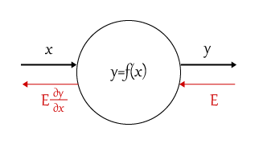

 - このことは、連鎖律の原理で説明できる
 - 連鎖率とは？
   - その話の前に、まずは合成関数の話をする必要がある

---

# 合成関数とは

複数の関数によって構成される関数のこと （$f(g(x))$のように表せる）

 

例えば
 - $z=(x+y)^2$ は $z=t^2$ と $t=x+y$ の合成関数である

---

# 連鎖律とは

合成関数の性質であり

> ある関数が合成関数で表される場合、その合成関数の微分は、合成関数を構築するそれぞれの関数の微分の積によって表すことができる

ということ
 - 例えば $z=(x+y)^2$ の微分$\frac{\partial z}{\partial x}$は、$z=t^2$ と $t=x+y$ を用いて

   $$\frac{\partial z}{\partial x}=\frac{\partial z}{\partial t}\frac{\partial t}{\partial x}$$
  - ...と求められる

**この流れを計算グラフで表現する**

---

# 連鎖律の計算グラフによる表現

$x$と $y$ を入力として$z=(x+y)^2$ を表現

 

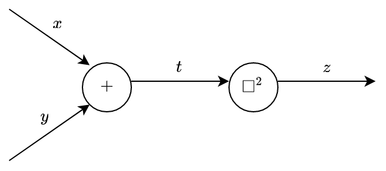

---

# 連鎖律の計算グラフによる表現

$x$と $y$ を入力として$z=(x+y)^2$ を表現

 

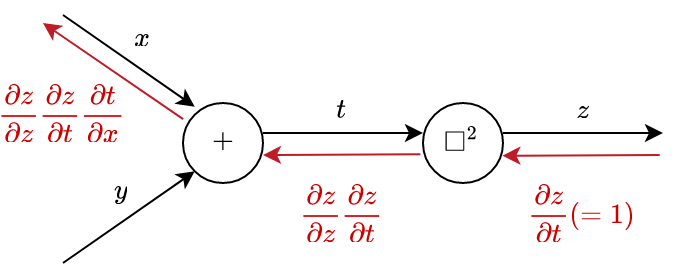

---

# 連鎖律の計算グラフによる表現

$x$と $y$ を入力として$z=(x+y)^2$ を表現

 

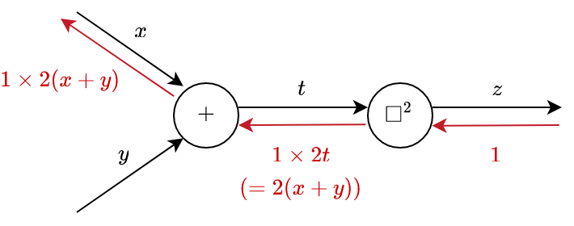

---

# 逆伝播による微分の考え方
 - **複雑な式も、単純な式として分解することで微分が可能となる**
 - 複雑な計算を単純な式として分解する計算グラフは、
 「合成関数」という観点で捉えられる
     - 合成関数の構成要素が、各ノードに対応
     - 連鎖律により、微分の手法を説明できる

---

# 5.3 逆伝播

---

# 具体的な逆伝播の流れ

 - 加算ノード・乗算ノードでは具体的にどのように逆伝播するのか？
 - ある計算中で、$x$ $y$ を与え$z$ を出力するノードを考える。
    - 最終的に出力する値は$L$ とする
  

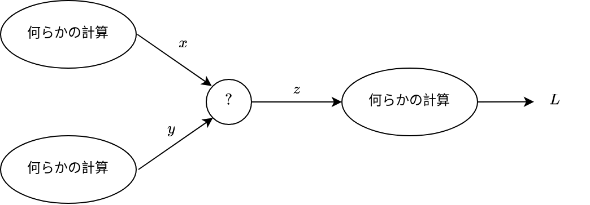

---

# 加算ノードの逆伝播
$z=x+y$ であるから

$$\frac{\partial z}{\partial x}=1, \frac{\partial z}{\partial y}=1$$

となり、ノードは以下のようになる
 - 入力された値をそのまま次のノードに流すだけ

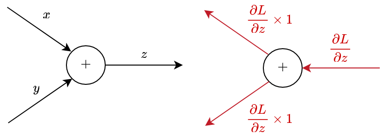

---

# 乗算ノードの逆伝播
$z=xy$ であるから

$$\frac{\partial z}{\partial x}=y, \frac{\partial z}{\partial y}=x$$

となり、ノードは以下のようになる
 - 各入力をひっくり返した形になる

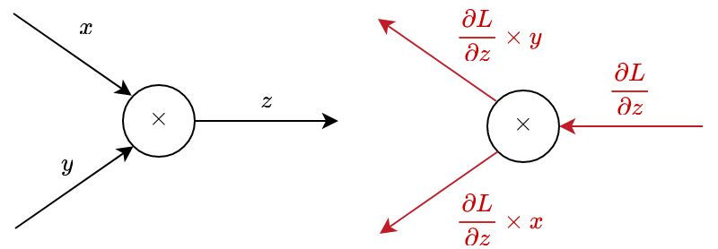

---

# 最初の問題を改めて見てみると

 - 乗算ノードの逆伝播の手法に則っていることがわかる

---

# まとめ
 - 計算グラフのノードは局所的な計算によって構成される
   - 局所的な計算が全体の計算を構成する
 - 計算グラフの順伝播は通常の計算を行い、逆伝播は各ノードの微分を求める
   - 逆伝播を用いることで、各パラメータに対する勾配を
     同時に求めることができ、計算効率が高い

---

# 5章後半について

 - 様々なノードの順伝播・逆伝播を理解し、実際に実装する
   - ニューラルネットワークを構成する「層（レイヤ）」として実装
     - 乗算レイヤと加算レイヤ
     - 活性化レイヤ （ReLU、Sigmoid）
     - Affine、Softmaxレイヤ
 - 誤差逆伝播法の実装に誤りがないかの検証方法
   - 数値微分と比較して行う手法を紹介

---

# 参考文献

『[DeepLearning] 計算グラフについて理解する』https://qiita.com/edo_m18/items/7c95593ed5844b5a0c3b