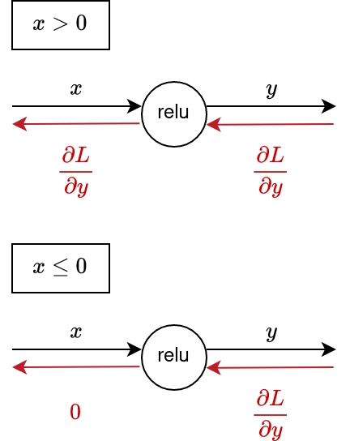
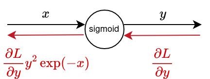
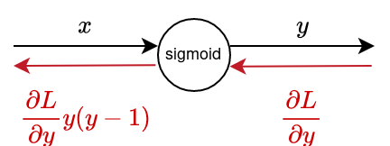
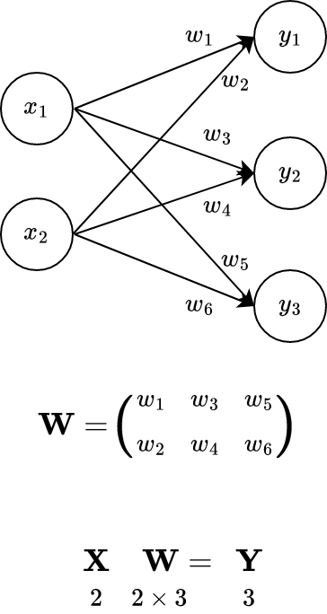

**ゼロから作るDeepLearning**
# 5章 誤差逆伝播法 2/2

多田 瑛貴
公立はこだて未来大学 システム情報科学部
複雑系知能学科 複雑系コース 2年


---

# 前章で学んだこと: 逆伝播への理解

 - 「計算グラフ」を用いて計算過程を「局所的な計算」の連なりとして表現
   - これを用いて順伝播・逆伝播を説明
   - 順伝播: 通常の計算を行う
   - 逆伝播: 微分(勾配)を求める
 - 誤差逆伝播法のモチベーションを理解
   - 計算過程の途中で勾配計算(逆伝播)の結果を保持し
    他のパラメータに対する勾配計算に再利用することができる
   - **効率的な勾配計算を実現**

---

# 今回学ぶこと: 誤差逆伝播法の実装 

 - 様々なノードの順伝播・逆伝播を理解し
    Pythonを用いて実際に実装する
   - ニューラルネットワークを構成する「層（レイヤ）」として実装
     - 乗算レイヤと加算レイヤ
     - 活性化レイヤ （ReLU、Sigmoid）
     - Affine、Softmaxレイヤ
    - これらを用いて、 **ニューラルネットワークでの学習を実践する**
 - 誤差逆伝播法の実装に誤りがないかの検証方法
   - 誤差逆伝播法は実装が複雑であり、ミスしやすい
   - 数値微分と比較して行う手法を紹介

---

# 5.4 単純なレイヤの実装

---

# 補足: 「クラス」とは

誤解を恐れずに説明すると...

**変数の型**であり
 - いろんな種類の値を、複数保持できる
   - = たくさんの変数を中に持っている
 - 関数を紐付けられる (保持している値を直接利用できる)

適切な捉え方ではないが、とりあえず今はこの理解でOK
*クラスのコンセプトは、オブジェクト指向プログラミングと同時に学ぶことになるはず*

----

# 補足: 「クラス」の例

```py
class Human: # 人間クラス
    def __init__(self, name):               # クラスを初期化する関数
        self.name = name                    # データ"name"を保持

    def greet(self):                        # あいさつする関数
        print("Hello, I'm " + self.name) 

peruki = Human("Teruki TADA")   # あいさつできる人間「peruki」を変数(インスタンス)として定義
print(peruki.name)              # > "Teruki TADA"
peruki.greet()                  # > "Hello, I'm Teruki TADA"
```

---
# Pythonによる実装の方針

各レイヤは、pythonのクラスとして記述される

```py
# 乗算レイヤーを表現するクラス
class Layer:
    def __init__(self):              # 初期化する関数
        ...
    def forward(self, x, y):         # 順伝播
        ...
    def backward(self, dout):        # 逆伝播
        ...
```
以下のようにインスタンスを作成
このインスタンスを使って、ノードの入出力を表現
```py
# 乗算レイヤーのインスタンス
layer = Layer()
```

---
# 順伝播の実装の方針

2つの入力`x` `y`から順伝播し、`output`に代入
```py
output = layer.forward(x, y)
```
### 例 (乗算レイヤの場合)
```py
mul_layer = MulLayer()
apple = 100
apple_num = 2
output = mul_layer.forward(apple, apple_num)
print(output) # -> 200
```

---

# 逆伝播の実装の方針

入力`dout`から逆伝播し、`output1` `output2`に代入
```py
output1, output2 = layer.backward(dout)
```
### 例 (乗算レイヤの場合)
```py
dapple, dapple_num = mul_layer.backward(dout)
print(dapple, dapple_num) # -> 2.2, 110
```

---

# 乗算レイヤ

```py
class MulLayer:
    def __init__(self):
        self.x = None
        self.y = None

    def forward(self, x, y):
        self.x = x
        self.y = y                
        out = x * y

        return out

    def backward(self, dout):
        dx = dout * self.y
        dy = dout * self.x

        return dx, dy
```

---

# 加算レイヤ
```py
class AddLayer:
    def __init__(self):
        pass                        # 何もしない

    def forward(self, x, y):
        out = x + y

        return out

    def backward(self, dout):
        dx = dout * 1
        dy = dout * 1

        return dx, dy
```

---

# りんごの値段の問題を解いてみる

 > 太郎くんはスーパーで1個100円のりんごを2個買った。支払う金額を求めよ。ただし、消費税は10%とする。

---

# 5.5 活性化関数レイヤの実装

---

# 活性化関数とは

入力された値の総和を調整し、出力に変換する関数のこと

`図3-5`

*参照: 3.2 活性化関数*


**ReLU**関数や**Sigmoid**関数がある


---

# ReLUレイヤ

ReLU(Rectified Linear Unit)関数は
以下の式で表される

$$
y=
  \left\{ 
  \begin{alignedat}{2}   
    x (x>0) \\   
    0 (x \leq 0)
  \end{alignedat} 
  \right.
$$

グラフは右図の青線のようになる
(橙線はその微分(後述)) 


---

# ReLUレイヤの勾配

ここで、$x$に関する$y$の微分は

$$
\frac{\partial y}{\partial x}=
  \left\{ 
  \begin{alignedat}{2}   
    1 (x>0) \\   
    0 (x \leq 0)
  \end{alignedat} 
  \right.
$$

のようになる。つまり

 - 順伝播時の$x$が0より大きければ
    逆伝播では上流の値をそのまま下流に返す
 - $x$が0より小さければ、何も流さない
    (信号をストップする)



---

# ReLUレイヤの実装

```
```
---


---


# Sigmoidレイヤ 

$$y=\frac{1}{1+\exp{(-x)}}$$


グラフは右図の青線のようになる
(橙線はその微分(後述)) 


---

# Sigmoidレイヤの勾配

ここで、$x$に関する$y$の微分は

$$\frac{\partial y}{\partial x}=y^2\exp{(-x)}$$

となる(導出は省略)。



---

# Sigmoidレイヤの勾配の簡略化

微分した式は、もっと簡略化にできる
$$
\begin{align}
    y^2\exp{(-x)}
    &= \frac{1}{(1+\exp(-x))^2}\exp{(-x)} \\
    &= \frac{1}{1+\exp(-x)}\frac{\exp{(-x)}}{1+\exp(-x)} \\
    &= y(1-y)
\end{align}
$$

---

# Sigmoidレイヤの勾配

$$\frac{\partial y}{\partial x}=y(y-1)$$

最終的に
**順伝播の出力($y$)だけを使って**
逆伝播の結果を計算することが
できる



---

# Sigmoidレイヤの実装

```
```

---

# 5.6 Affine/Softmaxレイヤの実装


---

# 重み付きの和の計算

ニューラルネットワークの順伝播では
「重み付きの信号の総和」を求める必要がある
*参照: 3.3 多次元配列の計算*


この計算を行うレイヤを
**Afiineレイヤ**と呼ぶことにする
*いわゆるAffine変換と直接の関係はない、ただやっている計算が同じというだけ*



---

# Afiineレイヤの実装

```
```

---

# 「バッチ版」Affineレイヤについて

先程の実装では、入力するデータは1個(1次元のベクトル)だった
N個のデータ (=「バッチ」) も同時に扱えないか？
*データの集まりは「バッチ」と呼ばれる*

入力を行列にし、Affineレイヤに適用する**バッチ版Affineレイヤ**を実装していく

---

# バッチ版Afiineレイヤの実装

```
```

---

# Softmax関数について

**Softmax関数ってなんだったっけ**

入力された値を正規化して出力
(出力の総和が1になるように変形)


この計算を行うレイヤを**Softmaxレイヤ**と呼ぶことにする

---

# Softmaxレイヤ導入のモチベーション

ニューラルネットワークで行う処理には「推論」「学習」の2つのフェーズがある
 - **推論**: 答えを出す処理
 - **学習**: 答えを出すためのパラメータを調整する処理

推論の段階では、出力の最大値にだけ興味があるので、正規化は求められない
→Softmaxレイヤいらない、Affineレイヤの出力(スコア)で処理を終了

Softmaxレイヤは**学習の段階**で求められる
→損失関数を適用し、性能を評価するため
*そういえばMNISTを使った学習では、*
*教師データとしてt = [0,0,0,1,0,...,0,0]のようなベクトルが用いられていた*

---

# Softmax-with-Lossレイヤ

損失関数である**交差エントロピー誤差**を含めたレイヤとして実装

---

# Softmax-with-Lossレイヤの計算グラフ

```
```

非常に複雑なため、書籍では省略されている (**付録A**を参照)
ここでは結果のみを紹介

---

簡略化し、次のように考える

```
```

---

# 逆伝播の結果

**なんか綺麗になった！**

交差エントロピー誤差は、Softmax関数の損失関数として
都合の良いように設計されている (偶然の産物ではない)
一方で、もう一つの損失関数である2乗和誤差は、恒等関数に対して都合が良い


---

# 5.7 誤差逆伝播法の実装

---

# ニューラルネットワークの学習の全体図

### 前提
ニューラルネットワークには「重み」「バイアス」があり
それらを訓練データに適応するように調整していきたい

---

# ニューラルネットワークの学習の全体図

### 学習のステップ

1. **ミニバッチ**
    訓練データの中からランダムに1つデータを選び出す
2. **勾配の算出**
    各重みパラメータに関する損失関数の勾配を求める
    *誤差逆伝播法はこのステップで、勾配を効率的に求めるために用いられる*
3. **パラメータの更新**
    重みパラメータを勾配方向に微少量だけ更新する
4. **繰り返し**
    ステップ1,2,3を繰り返す

---

# 誤差逆伝播法に対応したニューラルネットワーク

全体のレイヤの構造はこのようになる

---

# 誤差逆伝播法に対応したニューラルネットワーク

実際に実装してみる

```
```

---

# 誤差逆伝播法の勾配確認

**その勾配、本当に正しい？**

誤差逆伝播法は数値微分と比べ、実装が複雑であり、ミスも起こりやすい

そこで、数値微分による勾配の計算結果と比較し、実装に誤りがないかを確認する
(このような作業を**勾配確認**という)

---

# まとめ

 - 乗算・加算だけでなく、ニューラルネットワークの実装に求められる
    複合的な関数や行列計算にも逆伝播を適用できる
 - 損失関数として交差エントロピー誤差を用いることで、
    Softmax-with-Lossレイヤによる逆伝播の計算を簡略化できる
 - 誤差逆伝播法は実装が難しいことから、数値微分と計算結果と比較することで
    実装の正しさを検証する「勾配確認」が行われる


