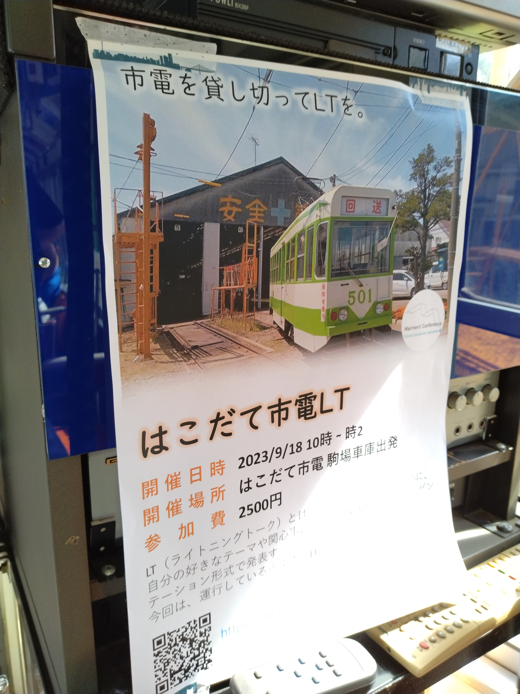

# 市電LTのあらまし

by 多田 瑛貴 (ぺるき)

DH-SynapseLT会 2023/12/2

---

# 自己紹介

**多田 瑛貴** ただ てるき

公立はこだて未来大学 システム情報科学部 2年

**X** @PerukiFUN
**GitHub** TadaTeruki
**HP** portfolio.peruki.dev

---

# 自己紹介

地図とパソコンが好きです

**主な興味**
 - LTサークル Mariners' Conference 部長
 - 手続き的生成 (CG)
 - 地理情報システム
 - Linuxデスクトップ

---

# Mariners' Conference

はこだて未来大のLTサークル

未来大生と函館のための
オープンな技術コミュニティを目指す
- [詳細はこちら](https://scrapbox.io/mariconf/Mariners'_Conference%E3%81%B8%E3%82%88%E3%81%86%E3%81%93%E3%81%9D)

---

### はこだて未来大に興味のある方は..

[募集要項(編入学)](https://www.fun.ac.jp/wp-content/uploads/2023/03/2024youkou-transfer.pdf)

---

# 市電LTとは

- 「函館市電の車両内でLTしよう」
- [詳細はこちら](https://scrapbox.io/mariconf/%E3%82%A4%E3%83%99%E3%83%B3%E3%83%88%E4%BC%81%E7%94%BB%E3%80%8C%E5%B8%82%E9%9B%BBLT%E3%80%8D)
- 未来大生だけでなく、函館市内の高校生や社会人
札幌や東京からの来訪者も巻き込んだ

---

# ポストを見てみよう

https://twitter.com/search?q=%23%E5%87%BD%E9%A4%A8%E5%B8%82%E9%9B%BBLT&src=typed_query&f=top

---

# きっかけ

- アイデアの大元は「流氷交差点」の中村さんの回 
- それを視聴したJugesuke君の提案により議論が始まり、開催に漕ぎ着ける

---

# 開催の流れ(1)

[詳細はこちら](https://scrapbox.io/mariconf/%E3%82%A4%E3%83%99%E3%83%B3%E3%83%88%E4%BC%81%E7%94%BB%E3%80%8C%E5%B8%82%E9%9B%BBLT%E3%80%8D)

- Scrapboxで企画書を書く
  - キャッチコピー大事 (？)
- 旧Twitterで大々告知

---

# 開催の流れ(2)

1回目のミーティングで企画の説明を行い、運営メンバーを決める
  - [詳細はこちら](https://scrapbox.io/mariconf/%E5%B8%82%E9%9B%BBLT_MTG_6%2F17)

---

# 開催の流れ(3)

**運営メンバーで市電見学会を開催**

車庫に入れてもらい、
借りる市電の車両を確認

使うコンセントやモニターの仕様、
収容人数などを確認
  - [詳細はこちら](https://scrapbox.io/mariconf/%E5%B8%82%E9%9B%BBLT%EF%BC%9A%E5%B8%82%E9%9B%BB%E8%A6%8B%E5%AD%A6%E4%BC%9A%E3%81%AB%E3%81%A4%E3%81%84%E3%81%A6)

---

# 開催の流れ(4)

- 2回目のMTGで、開催日と当日までの動きを決める
  - [詳細はこちら](https://scrapbox.io/mariconf/%E5%B8%82%E9%9B%BBLT_MTG_7%2F23)
- 3回目の直前MTGで、当日の動きと持ち込む備品を確認
  - [詳細はこちら](https://scrapbox.io/mariconf/%E5%B8%82%E9%9B%BBLT_MTG_9%2F16)

---

# 工夫点: 責任の分散

- マリカンのイベントなどではワンオペになりがち
- 今回は、大きな事務も運営メンバーの誰かに頼むことにした
  - 市電関係者との事務手続き
  - ポスター制作
  - connpass作成
  - 設営とその準備(設備の仕様の確認も含む)
- 自分はMTGに集中
  - 初めての取り組みでありながら、致命的なミスを避けられた

---

# 反省点: connpassページの募集枠

- [connpassページはこちら](https://mariconf.connpass.com/event/293719/)
- 運営メンバーの参加を保証するため、connpassでの申し込みは不要に
  - 盛り上がりのないイベントに見えてしまっていたかも
    - 実際、行きたいと言っていた人はもっと多くいたが、最終的な申し込み人数は少なかった
 - 後述する公開のタイミングも含めて、もう少し内容を詰めるべきだった

---

# 反省点: 準備不足

- connpassページの公開が10日程前になってしまった
  - 対象がグローバルであるのなら、1〜2ヶ月前には開催日を公開しておくべきだった
- 当日の動きを確認するためのMTGが開催前日になってしまった
  - この前後で機材の不足なども判明し、いろいろ大変だった
  - ジャンボさんの計らいによりMIRAI BASEの備品を借りてなんとかなったが、今後は気をつけたい

---

# 取り組むべきこと

両方の課題点も「できるだけ早めに動く」ことで回避できるが...
 - 重要であることはわかりきっている
 - 気をつけようという強い思いできるものではない
    - 「そろそろやっておくべきじゃない？」と
    叱責してくれる人がいればいいが...

---

**と、ほのめかしてみたら**

---

# 作ってくれた！

---

# ミーティングbotについて

制作したのは、未来大への入学を検討している高校生 **piro** 氏

12月中に運用予定 (遅れまくり)

---

# 運用例

---

# 運用例

 

---

# まとめ

頭のおかしい技術イベントも
現実的なプランさえ立てれば、あとはアイデア次第でなんとかなる

**筑波でもぜひ何か立てて！**
