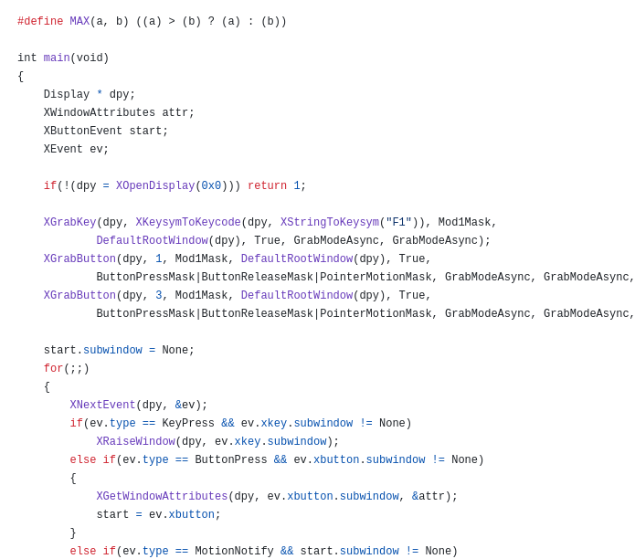
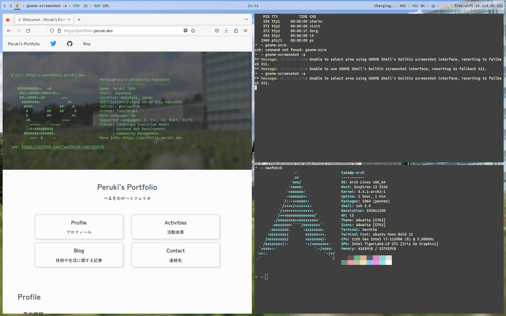
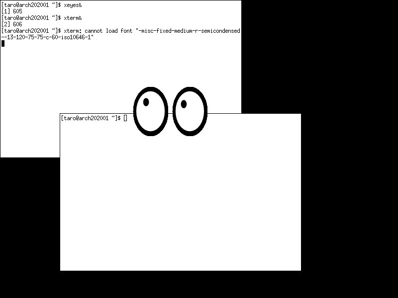
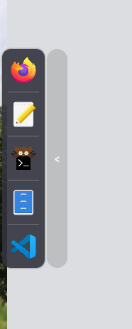

# 読むWM "tinyWM" をちゃんと読む

ぺるき *多田 瑛貴*

TOGATTA SERVER LT Vol.4 - 2023/9/30



---

# 自己紹介

**多田 瑛貴** ただ てるき

公立はこだて未来大学 システム情報科学部 2年

**X** @PerukiFUN
**GitHub** TadaTeruki
**HP** portfolio.peruki.dev


---

# 自己紹介

**主な興味**
 - 手続き的生成 (CG)
   - 特に地形生成
 - 地理情報システム
 - Linuxデスクトップ


---

# 今回のお話

Linux系のGUIの中身のお話

**X11における**
**「WM(ウインドウマネージャ)」** 
を、実際に読んで理解しよう


---

# X11 (X Window System)とは

Unix、Linux系OSでよく使われる
ウィンドウシステムの一つ
 - GUI環境の基礎を提供
 - ウインドウを画面上に描画したり
   マウスやキーボードによる入出力を
   ディスプレイに反映する、など


---

# X11 (X Window System)の構造

クライアントサーバーモデルに基づいている
 - **Xサーバー**
   - ディスプレイの描画
   - キーボードやマウスの入力の受け取り
 - **Xクライアント**
   - 主に、各GUIアプリケーション

これらソフトウェアが**Xプロトコル**を通してやりとりする

*"X11"そのものは何らかのソフトウェアを指さない*

---

# Xサーバーについて

- Xクライアントをディスプレイに描画
- キーボードやマウスから入力を受け取り、Xクライアントに送る

一方で、ウインドウの位置関係・前後関係などを
よしなに設定してくれる機能は持たない

橋渡し的な存在が必要 → **WM(ウインドウマネージャ)** が用いられる

---

# WM (ウインドウマネージャ) とは

特別なXクライアントで、主に以下を担当

 - ウインドウの位置関係・前後関係の管理
    - 受け取った入出力を反映させる
 - ウインドウの装飾
    - ウインドウのタイトルバーなど

*自作できるとめちゃめちゃロマンがある*


---

# 一般的に利用されるWM

基本的にはOS(Windows, MacOS)や

デスクトップ環境(GNOME, KDEなど)に
紐付いている

一方で、Linuxでは
`i3`や`awesome`、`icewm`、`sway`など
独立したWMも使われている

*画像は自分の環境の`i3`*


---

# tinyWMとは

https://github.com/mackstann/tinywm

このWMを**50行のCコード**で
ミニマムに実装したもの
*実用には耐え難いが、ちゃんと動く！*


---

# tinyWMとは

実装されている機能は以下の3つ:
 - ウインドウの移動 
   - 縦横移動 (掴んで動かす)
   - 最前面への移動
 - ウインドウの拡大縮小

*タイトルバーなどの装飾は実装しない*



*画像: https://qiita.com/ai56go/items/dec1307f634181d923f5*

---

# LTの動機

tinyWMのコードリーディングは
WM開発に入門するアプローチの一つ

自分自身もWM開発には興味があるが
こういったのをしっかり精読したかというとそうでもない

**X11のウインドウマネージャがどう動いてるのか眺めてみる**

---

# ソースコードを見てみよう
https://github.com/mackstann/tinywm

---

# 基本的な流れ

1. **Xサーバーへの接続**
2. **受け取る入力イベントの「グラブ」**
3. **メインループ**
     - ユーザーの入力の受け取る
     - 入力の内容をディスプレイに反映

*「グラブ」という謎多き操作を説明する日本語の文献が全く見当たらない*


---

# tinyWMの概観

```c
#include <X11/Xlib.h>

int main(void)
{
    ((変数の定義))

    [ ] Xサーバーへの接続
    [ ] 入力イベントのグラブ

    for(;;)
    {
        [ ] ユーザーの入力の受け取る
        [ ] 入力の内容ごとにディスプレイに反映
    }
}
```

---

# Xサーバーへの接続 - XOpenDisplay

```c
Display * dpy;
```

```c
if(!(dpy = XOpenDisplay(0x0))) return 1;
```

この関数で初めてXサーバーとの通信が確立される
`dpy`には、Xサーバーの情報が挿入される *NULLだったら異常終了*

`dpy`を他のいろんな関数に引き回しすことで、Xサーバーとのやり取りを行う
*Xサーバーとのあらゆるやり取りは**Display型のメソッドとして提供される**と考えるとわかりやすいかも*

---

# tinyWMの概観

```c
#include <X11/Xlib.h>

int main(void)
{
    ((変数の定義))

    [x] Xサーバーへの接続
    [ ] 入力イベントのグラブ

    for(;;)
    {
        [ ] ユーザーの入力の受け取る
        [ ] 入力の内容ごとにディスプレイに反映
    }
}
```

---

# 入力イベントのグラブ

発生する入力イベントは、基本的にウインドウ(クライアント)側で受理される

しかしWM開発においては、入力の情報ウインドウではなくWM側で受け取りたいときがある
*例えば、ウインドウを移動するときや、リサイズするとき*

このとき、WM側で入力を受け取るようにするための操作が**グラブ**

---

# 入力イベントのグラブ

`XGrabKey`で`Alt+F1`をグラブ

```c
XGrabKey(dpy, XKeysymToKeycode(dpy, XStringToKeysym("F1")), Mod1Mask,
        DefaultRootWindow(dpy), True, GrabModeAsync, GrabModeAsync);
```

---

# 入力イベントのグラブ

`XGrabButton`で`Alt+右/左クリック`をグラブ

```c
XGrabButton(dpy, 1, Mod1Mask, DefaultRootWindow(dpy), True,
        ButtonPressMask|ButtonReleaseMask|PointerMotionMask, 
        GrabModeAsync, GrabModeAsync, None, None);
XGrabButton(dpy, 3, Mod1Mask, DefaultRootWindow(dpy), True,
        ButtonPressMask|ButtonReleaseMask|PointerMotionMask, 
        GrabModeAsync, GrabModeAsync, None, None);
```

---

# tinyWMの概観

```c
#include <X11/Xlib.h>

int main(void)
{
    ((変数の定義))

    [x] Xサーバーへの接続
    [x] 入力イベントのグラブ

    for(;;)
    {
        [ ] ユーザーの入力の受け取る
        [ ] 入力の内容ごとにディスプレイに反映
    }
}
```

---

# ユーザーの入力の受け取る

```c
XEvent ev;
```

XEventは様々なイベントを表現する共用体
(このあとイベントの種類によって`XButtonEvent`などにキャストされる)

```c
    XNextEvent(dpy, &ev);
```

ユーザーの入力の内容は、イベントとしてXサーバー内にキューされる
`XNextEvent`でイベントをデキューし`ev`に格納する

---

# tinyWMの概観

```c
#include <X11/Xlib.h>

int main(void)
{
    ((変数の定義))

    [x] Xサーバーへの接続
    [x] 入力イベントのグラブ

    for(;;)
    {
        [x] ユーザーの入力の受け取る
        [ ] 入力の内容ごとにディスプレイに反映
    }
}
```

---

# 入力の内容ごとにディスプレイに反映

```c
XEvent ev;
```

`ev.type`には入力の種類が格納される (`KeyPress`や`ButtonPress`など)

これを元に条件分岐

```c
    if(ev.type == ***) ...
    else if(ev.type == ***) ...
    else if(ev.type == ***) ...
```

入力の種類に応じて、ディスプレイ上のウインドウに対して操作を行う

---

# ウインドウの最前面移動
```c
    if(ev.type == KeyPress && ev.xkey.subwindow != None)
        XRaiseWindow(dpy, ev.xkey.subwindow);
```

イベントが`KeyPress`であり、かつカーソル上にウインドウがあれば
それを最前面に移動する

---

# ウインドウの選択


```c
XWindowAttributes attr;
XButtonEvent start;
```

```c
    else if(ev.type == ButtonPress && ev.xbutton.subwindow != None)
    {
        XGetWindowAttributes(dpy, ev.xbutton.subwindow, &attr);
        start = ev.xbutton;
    }
```

イベントが`ButtonPress`であり、かつカーソル上にウインドウがあれば
 - ウインドウの情報を`attr`に挿入する
 - イベントの情報を`start`で持っておく
   - いずれも、ウインドウの移動やリサイズのときに使う

---

# ウインドウの移動・リサイズ

```c
    else if(ev.type == MotionNotify && start.subwindow != None)
    {
        int xdiff = ev.xbutton.x_root - start.x_root;
        int ydiff = ev.xbutton.y_root - start.y_root;
        XMoveResizeWindow(dpy, start.subwindow,
            attr.x + (start.button==1 ? xdiff : 0),
            attr.y + (start.button==1 ? ydiff : 0),
            MAX(1, attr.width + (start.button==3 ? xdiff : 0)),
            MAX(1, attr.height + (start.button==3 ? ydiff : 0)));
    }
```

イベントが`MotionNotify`であり、かつカーソル上にウインドウがあれば
 - `attr` `start` 内の情報をもとにウインドウを移動・リサイズする
   - 移動かリサイズかは、`start`内に格納されたボタンの種類で判断
---

# ウインドウの選択の解除

```c
    else if(ev.type == ButtonRelease)
        start.subwindow = None;
```

イベントが`ButtonRelease`であれば、選択を解除する

---

# メインループで行うこと

 - キューされた入力イベントを一つ取り出す 
 - 入力イベントをもとにディスプレイ上に反映

これを繰り返している

---

# 読めた！

```c
#include <X11/Xlib.h>

int main(void)
{
    ((変数の定義))

    [x] Xサーバーへの接続
    [x] 入力イベントのグラブ

    for(;;)
    {
        [x] ユーザーの入力の受け取る
        [x] 入力の内容ごとにディスプレイに反映
    }
}
```

---

# 補足

 - 今回のは入力イベントのみを扱っているが
    他の様々な種類のイベントも同じ流れで処理される
    - 新しいウインドウの作成時や、非表示時、削除時など
 - X11は比較的古い技術
    - 新しく作るならWaylandを使うほうがナウいが...
        入門のハードルはまだ高い

*X11は複雑な設計が問題視され、次世代にあたるWaylandに置き換わりつつある*
*参考: https://wayland.freedesktop.org/architecture.html*

---

# もっといろんなことをするには

 - タイトルバーを実装する
 - ウインドウの移動やリサイズを
   ウインドウの外枠をつまんで行うようにする
   - このあたりを実装しようとすると
   難易度が結構上がる 
 - タスクバーやメニュー、ランチャーも作る
   - オレオレデスクトップ環境を作ろう

 - etc...

*写真は自分が過去に`sway`用に作ったdock*



---

# 結論

**WM開発は意外と簡単に入門できる**

みんなもやろう


---


# 参考資料

tinywm
https://github.com/mackstann/tinywm

Linux システムソフトウェア - グラフィックスシステムの概要
https://zenn.dev/hidenori3/articles/c2be2bd50fc8dd