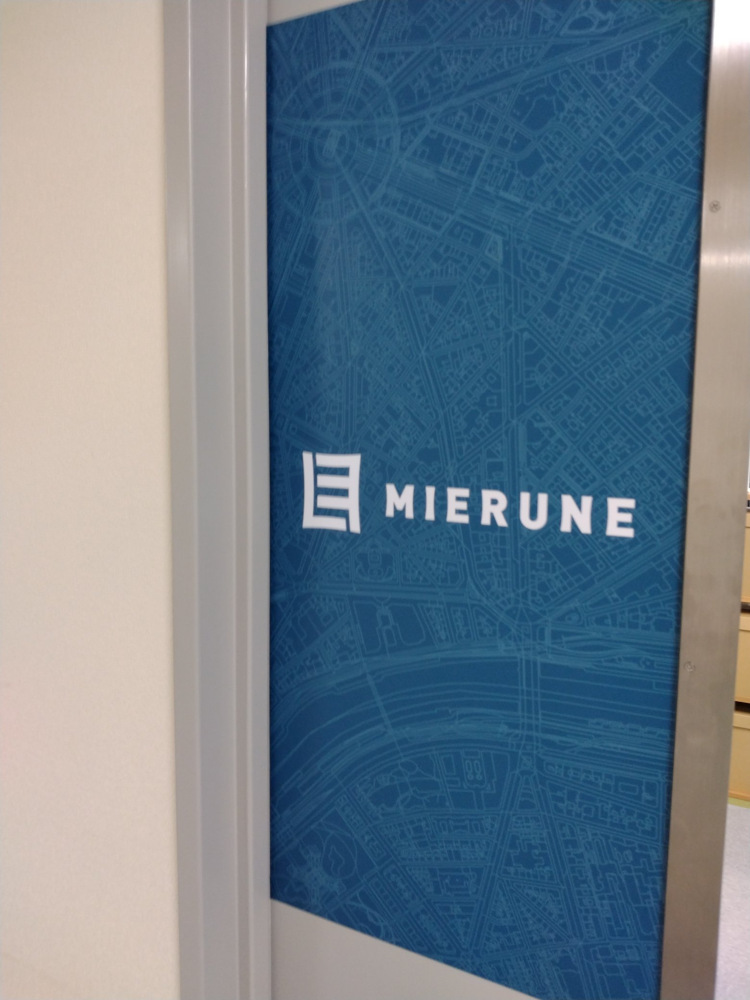
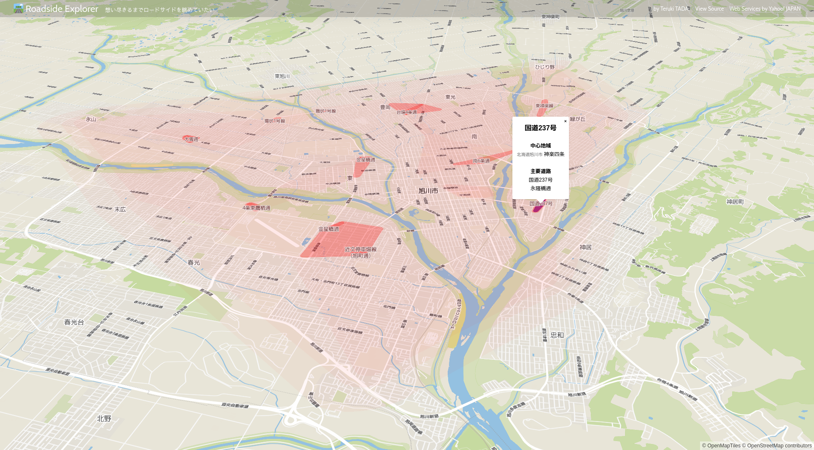
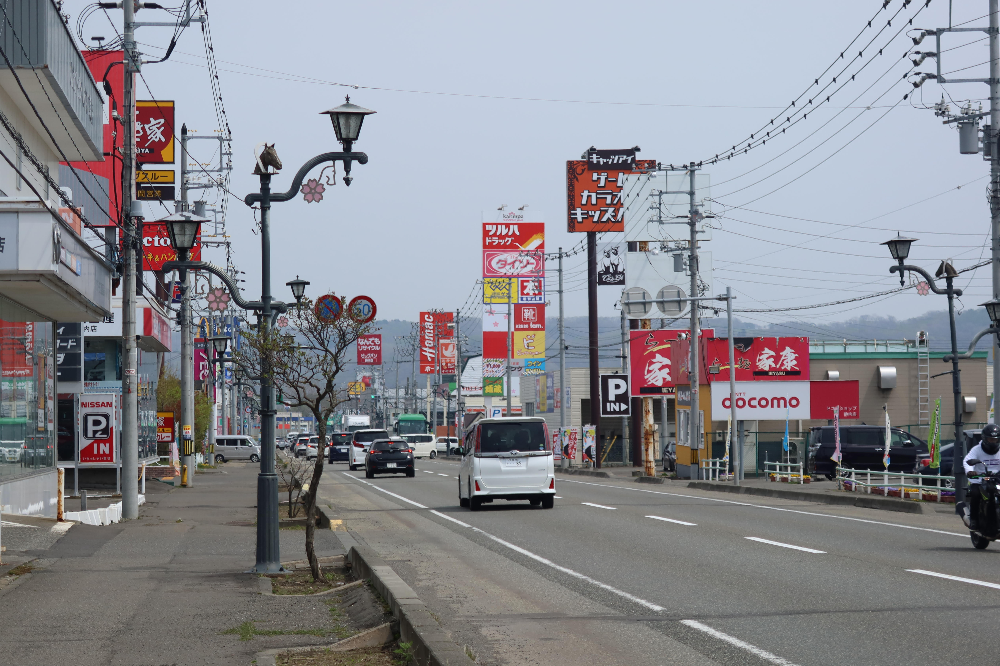
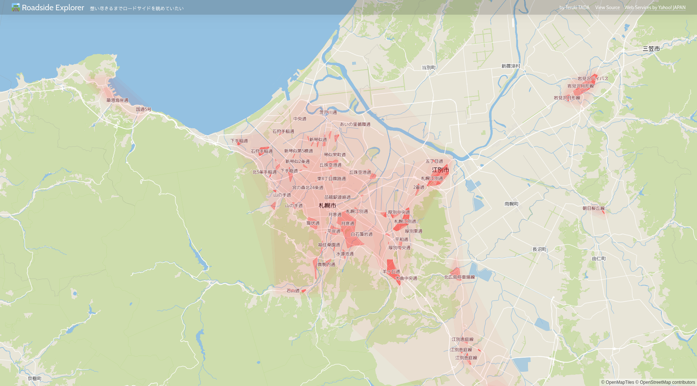
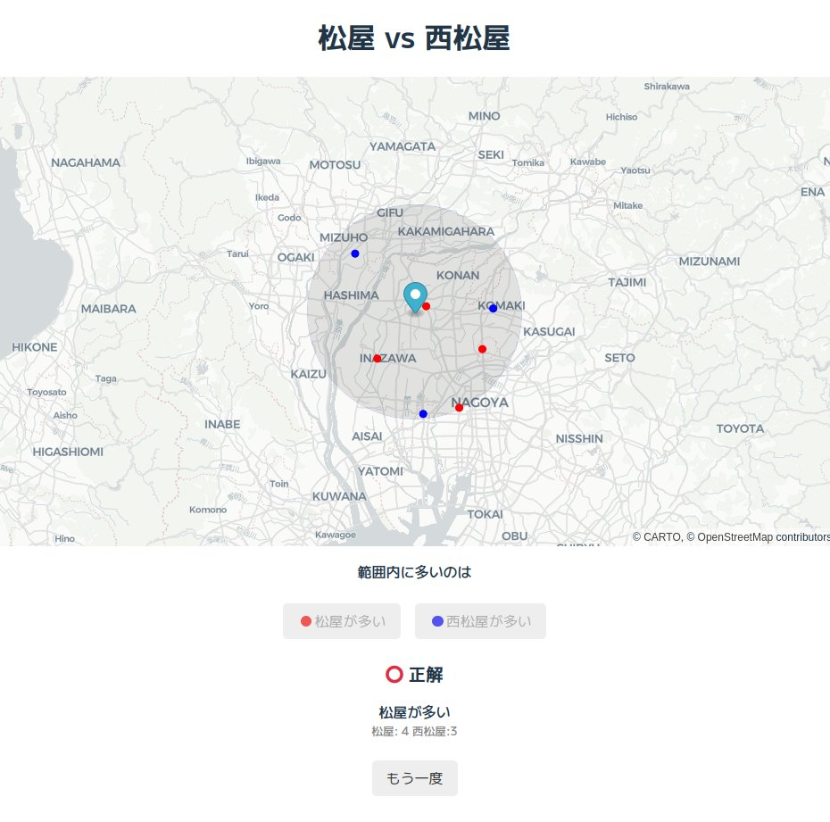

# MIERUNEインターンに行ってきた
多田 瑛貴

---

# 自己紹介

**多田 瑛貴** ただてるき

エックス: @PerukiFUN

公立はこだて未来大学
商業情報科学部 ロードサイド行脚科
イオン北海道コース

`$ curl https://perufetch.peruki.dev`

---

# インターンに行ってきました

**MIERUNE Inc.**
https://www.mierune.co.jp/

札幌にある企業
位置情報処理を中心とした事業を展開
FOSS4GはじめOSSコミュニティへの支援

---

# 開発したもの

 

**Roadide Explorer**
https://roadside-explorer.pages.dev/

ロードサイド店舗・
大規模商業施設の集まる地域を可視化

---

# 触ってみよう

---

# 処理の流れ

 - **ロードサイド店舗の点群データ**を取得
 - 点群をクラスタリング
   - クラスタリング結果を元に
     ポリゴンを作成
 - 地図ライブラリを使ってマッピング
 

    粒度の違う複数のクラスタリング結果を
    層状に重ね合わせることで、
    ヒートマップのような図ができる

    

---

# 課題

 - **ロードサイド店舗の点群データ**をどうやって抽出するのか

---

# ロードサイドって何

明確な定義は存在しない
- **感動するか否か**

主に、店の種類とブランドの有無と考えられる
- 「服屋」「家電」「ホームセンター」はロードサイドで見られる
- そのなかでも、ブランドのある店舗
    -  服屋 →「ユニクロ」「しまむら」「Right-on」
    -  家電 →「ヤマダ電機」「100満ボルト」

---

# どうやってロードサイド店舗を抽出する？

店の種類は無数にある
 - 「服屋」「家電」「ホームセンター」...

無数にあるものをどうやって抽出する？

---

# Overpass APIを使おう

---

# おまけ: 活用した技術

  - **MapLibre GL JS**
   フロントエンドの地図表示
   テスト用のGeoJSONの可視化にも役に立った
  - **Python**
    - scikit-learnやgeopandas
      POIデータのクラスタリングで活用
    - alphashape
      クラスタリング結果に基づいた地域ポリゴンの作成に活用
  - **YOLP (Yahoo! Open Local Platform)**
   リバースジオコーディングに使用し、地域の中心に関する住所情報を取得

---

# おまけ: 活用できなかったが、触れられた技術

 - **Valhalla**
    道路情報の付加には一部で利用できたが、問題が発生したため、最終的にはqgis_processを代替として使用
 - **AWS (EC2)**
    Valhallaの運用に活用
 - **turf.js**
    空間データ処理のため、様々な場面で使用を試みる
     - クラスタリング・ポリゴン作成など
    どれも問題が発生し、結局使えずじまいになってしまった

---

# インターンシップの感想

**多くのことを学べた**

GISの知識を幅広く習得
 - 過去の雑な開発で得た様々な知見が繋がり、幅広くスムーズに学習できた

CTOが机の横にいる状態で作業
 - いつでも聞ける

**作業が捗った**

アウトプットを**2つ**も出すことができ...そう
 - 2つ目はmainブランチに.envをぶち込んだため、歴史改変を余儀なくされている

---

# アウトプットの1つ目？

---

# アウトプットの1つ目

 

**松屋 vs 西松屋**
https://matsuyanishimatsuya.pages.dev/

地図ライブラリとGeoJSON処理の練習につくったやつ

