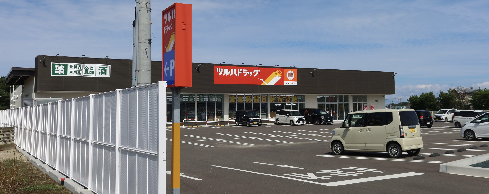

# 自己紹介

**多田 瑛貴** ただ てるき

**X** @PerukiFUN
**GitHub** TadaTeruki
**HP** portfolio.peruki.dev

---

# ああ...！ロードサイド行きたい...！

---

# そうだ！ロードサイド行こう！！！

---

# ロードサイドとは！？

郊外型店舗の集まる場所
**感動できる**

---

# けど、函館のロードサイドは もう巡りきったなぁ

 - 美原・昭和・石川
 - 七重浜・赤松街道
 - 峠下・戸倉
 etc...

---

# あと、道南にあったっけ

そういえば函館以外に大きな街はない

---

# そういえば... 夏のインターン...

---

# こんなものを 開発したなぁ...

---

# Roadside Explorer

全国のロードサイドの位置を推定・可視化

---

**うおおおお！！！**

# 他にも見つかるぞ！！！！

---

ということで

---

**行かなきゃ人生終了！**
# 道南の素晴らしい ロードサイド3選

---

# 一つ目: 二海郡八雲町

---

# 八雲のロードサイド

函館以外の道南では一番有名

**でも、実は未だ行けていない...！**
今日の発表では
軽めに・妄想で語る

*https://www.iju-join.jp/prefectures/hokkaido/47/index.html*

---

# うおお！！！ケーズデンキだ！！！

*https://hakodatedayo.blog.jp/archives/51178945.html*

---

# 山岡家だ！！！

*https://ameblo.jp/koba773/entry-12607294473.html*

---

# マックスバリュだ！！！

*https://www.aeon-hokkaido.jp/mv/shop/yakumo/*

---

# 八雲のロードサイド
大型家電量販店
初めて国道5号を渡る時ビビる

**素晴らしい**

*https://www.iju-join.jp/prefectures/hokkaido/47/index.html*

---

# 二つ目: 檜山郡江差町

---

# 江差に本当にあるの？？

江差は岬の切り立った場所にある街
高低差が激しく、土地の余裕もないはず

---

# 地図を見てみよう

---

**あきれかえるほど
平和な南檜山**

---

# おや...？
怪しい魔法陣が 展開され...

---

# ！！！！！

---

# 何が生まれたんだ！！！

---

# 素晴らしい駐車場だ！！！

---

# 素晴らしい駐車場だ！！！
**2つ目もあるぞ！！**

---

# パチンコ屋だ！！！
**しかも、目の前に競合までいる！！**

---

# なんかめっちゃ綺麗なディーラーだ！！！

---

# 江差のロードサイド

江差というよりも
**柳崎** (やなぎさき) **町**

---

# 江差のロードサイド

江差・厚沢部
乙部・上ノ国と
商圏を共有

**おそらく、檜山地方最大**

---

# 江差のロードサイド

大きな病院・高校もあり
檜山地方の隠れた拠点にも見える
国道から見通せる 風力発電が壮観

**素晴らしい**

---

# 三つ目

---

# あれ？？もうない？？

 - 松前にも瀬棚にも森にも、まとまったロードサイドはない
 - 長万部にもない ※**ドライブイン**ならある
 - 木古内は少し大きい街だけど ロードサイドはない
 - 奥尻にも、渡島大島にもない

---

# いや、そんなことはないはず...

---

## そんなことはないはずなんだ...

---

**そう信じ続けた彼はいつのまにか大海原に繰り出していた**

---

# ここは... どこだ...

---

# ...！！！

---

# ！！！！！！！！！！！！！！！！！！！！！！！！！！！！！！！！！！！！！！！！！！！！！！

---

# 三つ目: 北海道大間町

---

# 全日食チェーンだ！！！

**セルフレジもある！！最先端だ！！**

---

# ニコットだ！！！

**隣にすっげえ車屋さんもある**

---

# 旨い...旨い...

---

# ドラッグストアがバチバチだ！！！

---

# 大間のロードサイド

商圏は大きくなく
前述と比べると小規模
でも、そこにロードサイドはある！！

---

---

# 大間って青森県じゃね？？？

---

# そう、一般大衆は青森県だと罵っているが...

---

松前より北にある・魚が美味しい

**そう、北海道の定義を満たしており、疑うことなき道南である**

---

# こんな会社もあるじゃないか！！！

**大間が道南じゃないなら、いったい何南なんだ！！！！**

---

# 大間のロードサイド

商圏は小さいものの
力強く生きている

**素晴らしい**

---

# 八雲

*https://www.iju-join.jp/prefectures/hokkaido/47/index.html*

---

# 江差 柳崎

---

# 大間

---

**八雲・柳崎・大間**

# 道南三大ロードサイドだ！！！

---

おわり