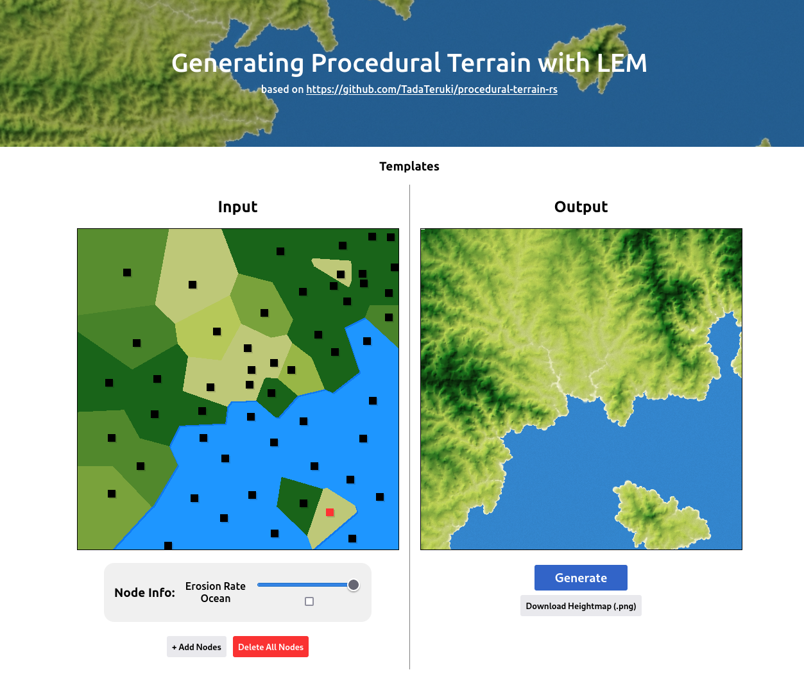

**ゲーム・映像表現の可能性を広げる**
# 地形生成ライブラリの開発

新雪プログラム 中間報告会

多田 瑛貴 Teruki TADA
*公立はこだて未来大学 システム情報科学部*

---

# プロジェクト概要

**地形学の数理モデルを取り入れた
汎用性の高いオープンな地形生成ソフトウェア・ライブラリ**

メディア用途に応用可能な
高品質な地形を容易に生成する計算基盤を提供

---

# 地形生成の課題

**メディア用途**
 - CG的アプローチ
   - ノイズ(パーリンノイズ)の重ね合わせが多い
   - 地形本来の雄大さを再現できない

**研究用途**
 - ライトに使うには厳密すぎるパラメータ
 - 限定される実行環境 (Python, MATLAB)

---

# プロジェクトの動機

地形学の数理モデルを取り入れつつ
ライトに扱うことのできる計算基盤を作り出したい

*その上で、オープンかつ汎用的でありたい*

**とにかくリアルな地形を生成したい！**

---

# 作成しているもの

**procedural-terrain-rs**
**https://github.com/TadaTeruki/procedural-terrain-rs**

地形生成のためのRust用ライブラリ
WebAssemblyでのビルドを想定

---

# デモ

---

# 地形生成の流れ

---

## 入力

地形生成のベースとなる入力データを作成

 - **ユーザーによる入力**
   - パラメータを持つ点群を入力
   - あるいは、グレイスケール画像による
   パラメータの指定
 - **計算機による自動生成**
   - ユーザーによる入力を擬似的に生成
   - パーリンノイズ等が用いられる

ここでは**侵食性(erodibility)** が主なパラメータとなる
*参考: https://en.wikipedia.org/wiki/Erodability*

---

## 出力

入力に基づいて、ネットワーク状のデータモデルを作成

数理モデルを適用し、入力されたパラメータに対応する地形を生成

*図表: Figure 1; Guillaume Cordonnier, Jean Braun, Marie-Paule Cani, Bedrich Benes, Eric Galin, et al.. Large Scale Terrain Generation from Tectonic Uplift and Fluvial Erosion. Computer Graphics Forum, 2016, Proc. EUROGRAPHICS 2016, 35 (2), pp.165-175. ￿10.1111/cgf.12820. hal-01262376￿*

---

## 数理モデルについて

**Landscape Evolution Model (LEM)**

地形の形成プロセスをシュミレートする数理モデル
  - 地形の形成には多くの要因が関わるが
    河川による侵食・堆積作用の影響が特に大きく、主な議論対象となる
  - 侵食・堆積作用を数理モデルとして表現することで
    物理に即した地形を計算機上で再現できる

---

## 実際に使用する数理モデル

**Salève** by Philippe Steer

 - パラメータ数が抑えられている
 - 解析的
   *(時系列に基づく連続的な処理を必要としない)*

*図表: Figure 2; Steer, P.: Short communication: Analytical models for 2D landscape evolution, Earth Surf. Dynam., 9, 1239–1250, https://doi.org/10.5194/esurf-9-1239-2021, 2021.*

---

# 期間中の成果

---

## ライブラリの実装を概ね完成

 - ユーザーの入力に基づいた地形の生成
   - ユーザーがすべき入力の定義
 - 設計の見直し
   - 数値計算部分の抽象化により
     平面データだけでなく、球面やトーラスへの
     対応も視野に入る *(future work)*
 - ライブラリのドキュメントの作成

不足している部分もあるが、骨格はできた

今後は、ライブラリを応用しながら改良を重ねていく

---

## 基礎アルゴリズムの実装と公開

**Natural Neighbor Interpolation**

空間上の離散的なデータの値を補間する
アルゴリズムの一つ

OSSとしてライブラリを公開
**https://crates.io/crates/naturalneighbor**

*振る舞いが複雑であり、開発が難航した*

---

## Webページの作成

ブラウザで動作可能

侵食性(erodibility) を持つ点群を
ユーザー自身で配置し
地形を自由にシミュレーション可能

*ドキュメントを併載予定*

---

# 次期間で行うこと

---

## 海からの侵食/堆積の影響が未実装

海岸の地形(海岸平野、浅瀬)は
十分に再現されていない

**10月末頃、参考になり得る先行研究を発見**

実装を試みたい

*https://youtu.be/VRXR86uRnUY?si=mPKIvm84I4z2Vmu5*

---

## ドキュメントの不足

現在揃っているドキュメントは
ライブラリの使用方法のみ

数理モデルの説明や、アルゴリズムの解説
参考文献の紹介が不足している

Webページ・GitHubを中心にドキュメントを追加したい

*写真は現行のドキュメント*

---

## より高度なビジュアライザの作成

現行のWebページとは別として、
3D視点を提供する
より高度なビジュアライザを作成したい

*Web地図と同じフレームワークの導入を試みる*

---

**ゲーム・映像表現の可能性を広げる**
# 地形生成ライブラリの開発
**procedural-terrain-rs**

多田 瑛貴 Teruki TADA
*公立はこだて未来大学 システム情報科学部*

