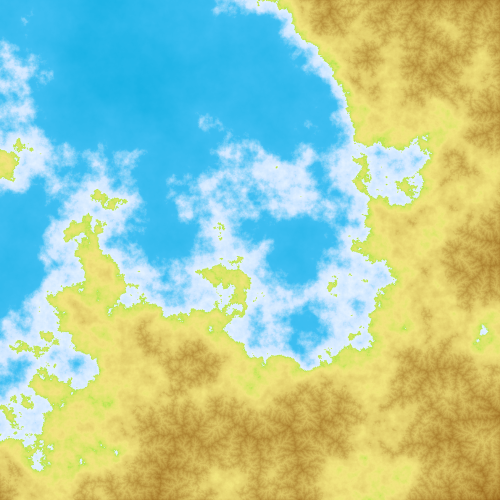
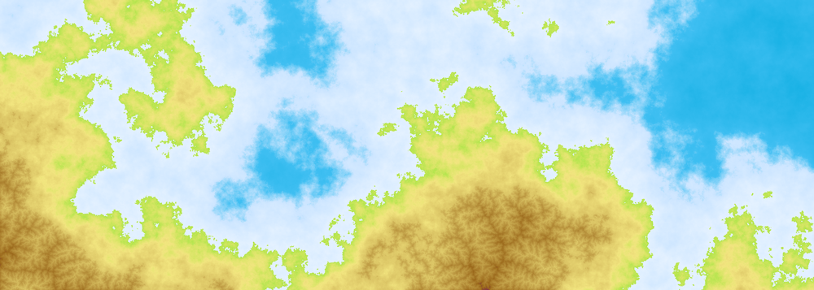

**ゲーム・映像表現の可能性を広げる**
# 地形生成ライブラリの開発

公立はこだて未来大学 システム情報科学部
複雑系知能学科 多田 瑛貴

---

## 目次
1. プロジェクト概要
2. 地形生成とはなにか
3. 現状の課題
4. 提案する解決策
5. 過去のアプローチ(RDGL)
6. 本プロジェクトの目標

---

# プロジェクト概要

 

**高品質な地形データを生成する地形生成ライブラリの開発**

 

---

# 地形生成とはなにか

地形生成は、ゲームや映像制作で用いられる技術。
- パーリンノイズによる方法が主流。
- Minecraftのワールド生成などで知られる。

---

# 現状の課題

- 現存の地形生成ツールは擬似的で、実際の地形の仕組みを取り入れていない。
- 実世界の河川ダイナミクスや海岸線、山々の風景などは、河川の侵食/堆積作用をはじめとした地形作用に基づく。
- 地形進化モデル(LEM)は研究分野として存在するが、汎用的なライブラリは少ない。

---

# 提案する解決策

- 地形学の数理モデルを取り入れた地形生成ライブラリの開発。
- ゲームや映像制作での利用を主眼に置く。
- 現状の疑似的な地形データを加工し、リアルな地形へ変換。
- 出力形式: PNG, JPG, CSV, OBJ など

---

# 過去のアプローチ(RDGL)

- Go言語向けの地形生成ライブラリRDGLを開発。
- 本プロジェクトでの機能はRDGLとほぼ同じ。
- RDGLは一部の画像を引用している。

---

# 本プロジェクトの目標

- 高品質な地形データ生成ライブラリの開発。
- オープンソースとして提供。
- ゲーム開発・映像制作の表現の可能性を拡大。
- 現存の擬似的地形データの加工機能も提供。

---