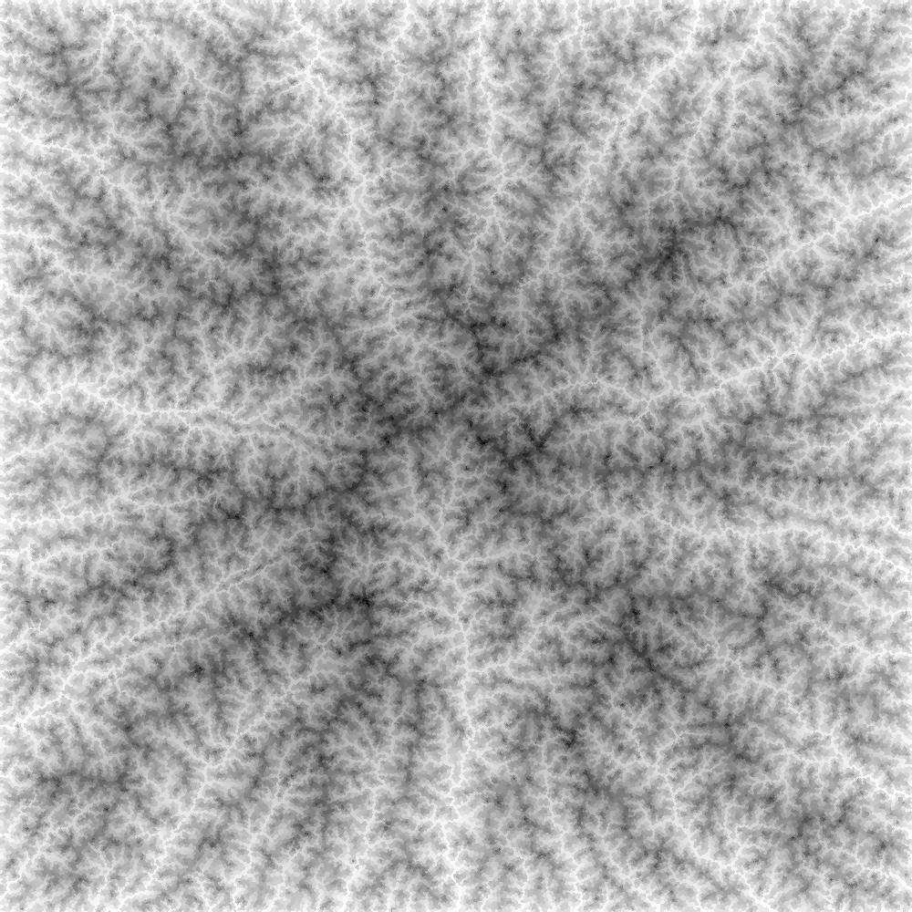

**ゲーム・映像表現の可能性を広げる**
# 地形生成ライブラリの開発

公立はこだて未来大学 システム情報科学部
複雑系知能学科 多田 瑛貴

---

# プロジェクト概要

 

**高品質な地形データを生成する地形生成ライブラリの開発**

 

---

# 地形生成とはなにか

地形生成は、主にゲーム開発で用いられる技術
- 「パーリンノイズ」と呼ばれる特殊なノイズを重ね合わせる方法が主流
- Minecraftのワールド生成などで知られる

*写真: OpenTTD, Minecraftの例*

---

# 現状の課題

現存の地形生成の方法は、表現の幅に限界があると考えている

---

---

---

---

# よりよい地形への追求

実世界の多様な海岸線の形
尾根と谷の連なる雄大な山の風景など

河川・氷河の侵食作用や
地殻の隆起といった**地形作用**に起因

*写真: 北海道新ひだか町静内の風景と、その標高データ*
*(出典:地理院地図)*

---

# 提案する解決策

実世界のような地形作用を厳密に再現することは計算機上では不可能
一方で、地形学分野の数理モデルを取り入れることで、
近似的な再現へのアプローチは可能である

---

# 提案する解決策

実際に、数理モデルに基づいて
計算機上で仮想的な地形を生成する試みとして
**「地形進化モデル」**
**(Landscape Evolution Model, LEM)** 
と呼ばれる地形学の研究分野がある

---

# 本プロジェクトの目標

**地形学の考え方を取り入れた
汎用性の高いオープンな地形生成ソフトウェア**

高品質な地形を容易に生成するツールの存在は
ゲーム開発・映像制作における表現の可能性を
大きく広げられるはず
 - 自分自身のライフワークへの追求でもある (地図帳の自動生成)

---

# 現在の進捗

---