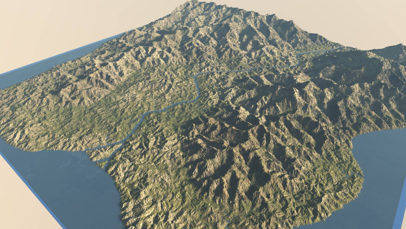
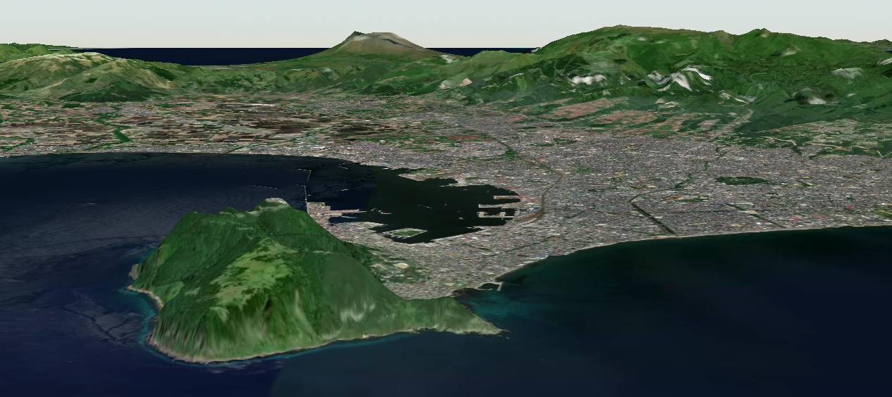

**ゲーム・映像表現の可能性を広げる**
# 地形生成ライブラリの開発

 

公立はこだて未来大学 システム情報科学部
複雑系知能学科 多田 瑛貴

---

# 自己紹介

公立はこだて未来大学 システム情報科学部
複雑系知能学科 多田 瑛貴

**HP**&emsp;portfolio.peruki.dev
**X(Twitter)**&emsp;@PerukiFUN
**GitHub**&emsp;TadaTeruki

主要分野
 - 手続き的生成
 - Linuxデスクトップアプリケーション
 - 地理情報システム (最近から)

*写真: roadside-explorer.peruki.dev*

---

# 自己紹介

「ぺるき」という名前で活動しています

**HP**&emsp;portfolio.peruki.dev
**X(Twitter)**&emsp;@PerukiFUN
**GitHub**&emsp;TadaTeruki

---

# プロジェクト概要

 

**高品質な地形データを生成する地形生成ライブラリの開発**

---

# 地形生成とはなにか

地形生成は、主にゲーム開発で用いられる技術
- 「パーリンノイズ」と呼ばれる特殊なノイズを重ね合わせる方法が主流
- Minecraftのワールド生成などで知られる

*写真: OpenTTD, Minecraftの例*

---

# 現状の課題

現存の地形生成の方法は、表現の幅に限界があると考えている

---

---

---

---

# よりよい地形への追求

実世界の多様な海岸線の形
尾根と谷の連なる雄大な山の風景など

河川・氷河の侵食作用や
地殻の隆起といった**地形作用**に起因

*写真: 北海道新ひだか町静内の風景と
その標高データ (出典:地理院地図)*

---

# 提案する解決策

実世界の地形作用を厳密に再現することは計算機上では不可能

一方で、**地形学分野の数理モデルを取り入れる**ことで
近似的な再現へのアプローチは可能

実際に、数理モデルに基づいて
計算機上で仮想的な地形を生成する試みとして
**「地形進化モデル」(Landscape Evolution Model, LEM)** 
と呼ばれる地形学の研究分野がある

---

# 先行研究の例

*Guillaume Cordonnier, Jean Braun, Marie-Paule Cani, Bedrich Benes, Eric Galin, et al.. Large Scale Terrain Generation from Tectonic Uplift and Fluvial Erosion. Computer Graphics Forum, 2016, Proc. EUROGRAPHICS 2016, 35 (2), pp.165-175. ⟨10.1111/cgf.12820⟩. ⟨hal-01262376⟩*

---

---

---

# 先行研究の課題点

 - 地形学の研究の範囲に収まっている
   - **ツールとしての汎用性・使いやすさは重視されてこなかった**
     - 正しく扱うには地形学の知識が必要 (パラメータなど)
     - MATLAB専用など、実行環境も限定される

 - **オープンかつ汎用的なライブラリを作りたい**

---

# 開発中のプレビュー

**Rust言語**による実装

---

---

---

# 本プロジェクトの目標

**地形学の考え方を取り入れた
汎用性の高いオープンな地形生成ソフトウェア**

高品質な地形を容易に生成するツールの存在は
ゲーム開発・映像制作における表現の可能性を
大きく広げられる

---

# 具体的な技術構成

 - 地形生成ライブラリを**Rust**にて開発
   - 様々なプラットフォームで扱えるよう**WebAssemblyに対応**
 - ビジュアライザを**JavaScript**にて開発

---

# 現在の進捗

 - 基盤ライブラリの製作 *80%完了*
   - パラメータの設定を文献にそのまま従った実装
 - ラッパーライブラリの製作 *製作中*
   - 誰でも扱える形で基盤ライブラリにアクセスするライブラリ
 - ドキュメント *製作中*

---

# 今後の予定

 - ビジュアライザ *製作予定*
   - Web上でアクセス可能なビジュアライザ
   - **地図ライブラリ**を用いた3Dによるビジュアライザを作れないか？
 - **サンプルゲーム**を作れないか？ *future work*

---

**ゲーム・映像表現の可能性を広げる**
# 地形生成ライブラリの開発

 

公立はこだて未来大学 システム情報科学部
複雑系知能学科 多田 瑛貴

