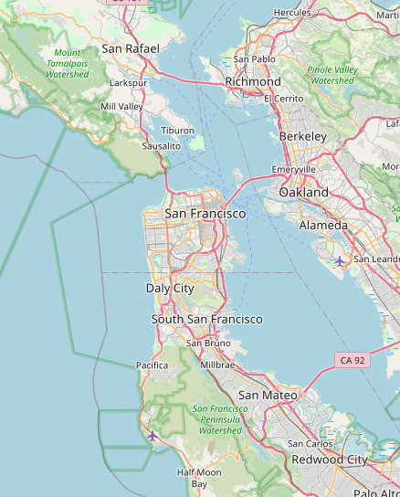
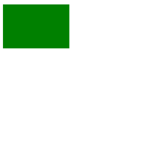
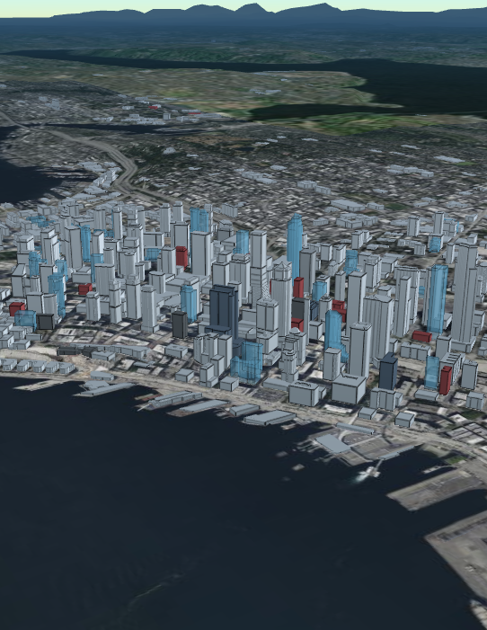
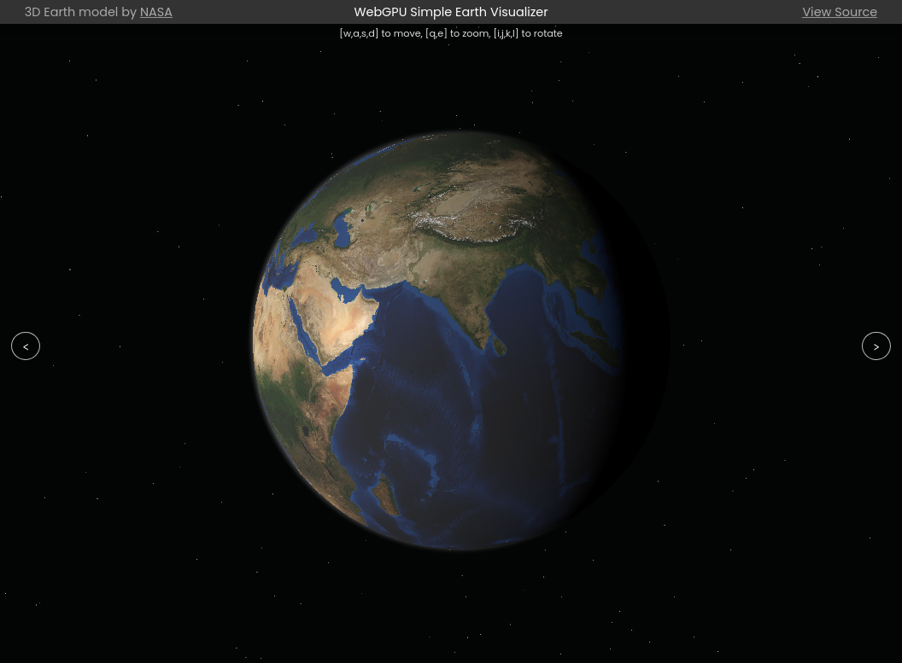

<style>
@import url('https://fonts.googleapis.com/css2?family=Noto+Sans+JP&display=swap');

footer {
    color: rgb(200, 200, 200);
    width: 100%;
}

section::after {
  color: rgb(200, 200, 200);
  content: attr(data-marpit-pagination) '/' attr(data-marpit-pagination-total);
}

:root {
  --color-back: rgb(255, 255, 255);
  --color-side: rgb(220, 240, 250);
}

section {
    background: linear-gradient(-30deg, var(--color-side) 7.5%, var(--color-back) 7.5%, var(--color-back) 94%, var(--color-side) 94%);
    background-size: cover;
    background-position: center;
    color: rgb(90, 90, 90);
    font-family: 'Noto Sans JP';
    text-decoration: none;
    font-size: 35pt;
}

em {
    font-weight: normal;
    font-style: normal;
    font-size: 30pt;
    color: rgb(130, 130, 130);
}

section h1,h2,h3,h4 {
    color: rgb(90, 130, 140);
    font-size: 50pt;
}

section a:link {
    color: inherit;
}

</style>

# 自己紹介

https://peruki.dev

多田 瑛貴 ただ てるき
はこだて未来大 B3

---

みなさん

# 函館はどうですか

---

函館は北海道の中心

---

**夜景だ！**

---

**市電だ！**

---

**ロードサイドだ！！！**

---

# またきてください

東京や札幌以外で第一級のカンファレンスが開催されたことが本当に嬉しい

今後のイベントもぜひ函館で

---

ということで...

---

# 未来大 大LT 協賛募集中です

毎年開催の学生LT
1月説明・5月開催予定

興味のある企業の方、ぜひお声掛けください

---

ということで本題です

---

# Webのグラフィックスを語りたい

 ~ 超速習WebグラフィックスAPI ~

---

みなさん

# Webのグラフィックス好きですか
*Canvas, WebGL, Three.js, etc...*

---

# 僕は

---  

# 悶えながら戦っている

---

# 経緯1

もとの興味は、

Linuxのデスクトップアプリ開発に収まっていた  

*GTK/X11環境で描画(Cairo、GLUTなど)*

---  

# 経緯2

B1でWeb開発に入門し圧倒される

- クロスプラットホームで配布が容易
- Web界隈の情報密度の高さに抗えない

以降、折れてWebのグラフィックスに転向

---

# Webでグラフィックスを扱う意義

- 自分が作った'面白いもの'を簡単に共有できる
*開発したものをURLのみで他人に共有できることは強力*
- Webの潮流に乗っかることができる

---

そういえば、Webでグラフィックスはどう扱うのか？

---

# Webのグラフィックス

レイヤや役割も様々

- 標準API: Canvas, WebGL, WebGPU
- 汎用ライブラリ: Three.js, Babylon.js, etc...
- 特化型ライブラリ: D3.js, Maplibre, etc...
- ゲームエンジン: Unity, Bevy, etc...

---

# Webのグラフィックス

レイヤや役割も様々

- **標準API: Canvas, WebGL, WebGPU**
- *汎用ライブラリ: Three.js, Babylon.js, etc...*
- *特化型ライブラリ: D3.js, Maplibre, etc...*
- *ゲームエンジン: Unity, Bevy, etc...*

---

# 標準APIを"すごく"
# ざっくり見ていこう

---

# Canvas

最もシンプルかつ
古典的な描画方法
2D描画のみ対応



---

# サンプル

緑色の四角形を描画

```javascript
ctx.fillStyle = "green";
ctx.fillRect(10, 10, 150, 100);
```

直接APIを叩いても簡単に扱える



---

# Canvasの懸念点

性能・表現力ともに限界がある
- 2Dグラフィックス用途のため

---

# WebGL (WebGL 2)

3D描画において
OpenGLと同等の機能を提供
*Canvasでは難しかった表現力を実現*



---

# WebGLの懸念点

OpenGLの機能をそのままWebに持ち込んだがゆえ
- ステートフルである
- 科学技術用途に設計されていない

...など、古い問題が山積みであった

---

# WebGPU

WebからGPUの機能にアクセスするためのAPI
- 新しい設計 
  - レンダリングパイプライン等の状態を
  自分で定義
- 汎用計算へのプライマリなサポート

---

# これを使うのが正義？

---

WebGPUを試そう

# WebGPUみくじ

---

**https://webgpu-simple-earth.peruki.dev**




---

# WebGPUの懸念点

ご覧のとおり、現状ほとんどのデバイスで動作しない
*Chromeのみ先行している状態*

2024年時点では、単体でまだ
実用的なAPIとは言い難い

---

# WebGL/WebGPUの位置づけ

グラフィックスにおいては
あくまで、**上位層の改善**が
WebGPUの主な目的

*WebGPUが使えない環境であれば*
*ライブラリ等が自動的にWebGLに切り替える場合も多い*

自分たちがWebGPUを意識する必要はない

---

# まとめ？

- グラフィックスAPIは三者三様
- Webでグラフィックス表現を扱うだけなら
普段自分たちが標準グラフィックスAPIを
意識する必要はない

---

しかし
知っておくことで
見える未来もある

---

# 最近の(個人的に熱い)トレンド

---

# wgpu 22.0 released！
**(8月1日)**

RustでWebGPUを扱うライブラリ
近年 22.0としてメジャーリリースされた


---

# RustでWebGPU？

WebGPU APIはJSから叩くはず
→ WebAssemblyビルド

---

# wgpuはWebだけでない！

シェーディング言語のクロスコンパイルが可能
(nagaクレート)
wgpuを用いた単一のコードベースで
WebGPU API・WebGL・Direct3D・Metal等
様々なネイティブのグラフィックスAPIを目指す

---

# 実際に触ってみた

問題点はまだ多そうだ

---

# wgpuの所感

- ライフタイムによる制約により
  requestAnimationFrameなど、フレームや
  キー入力のコールバックを扱うのがとても面倒
- WebGL対応が不安定

---

# wgpuの所感

- 主要チュートリアルで用いられている
ウインドウ作成フレームワークwinit
バージョン変更によりいきなり相性崩壊した
→ 入門が厳しい？？？

---

# wgpuへの勝手な期待

Rustは空間情報処理(グラフィックス/ジオ等)系の
エコシステムが充実してきている

*RustGeoやBevyのようなプロジェクトのほか、
線形代数や幾何計算の細かなライブラリまで*

その恩恵をWeb上で受けられるのは良いこと
*頑張ってほしい！*

---

# まとめ2

- WebGPUはクロスプラットホームの
グラフィックスAPIとしての側面も持つ

- Wasmを挟むことで、単一のコードから
開発環境・動作環境に依存しない
高度なグラフィックス開発の可能性が期待される