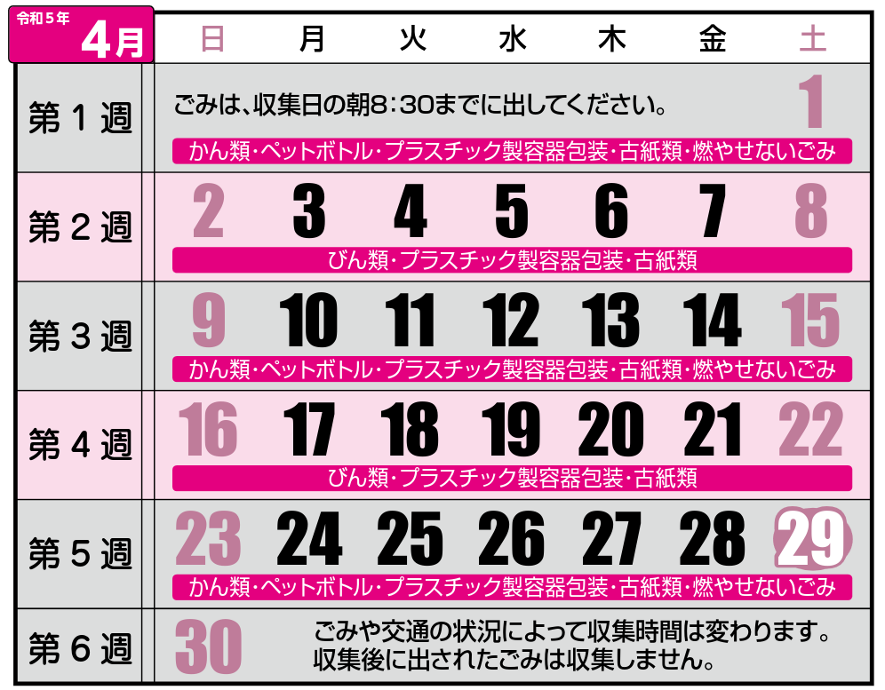
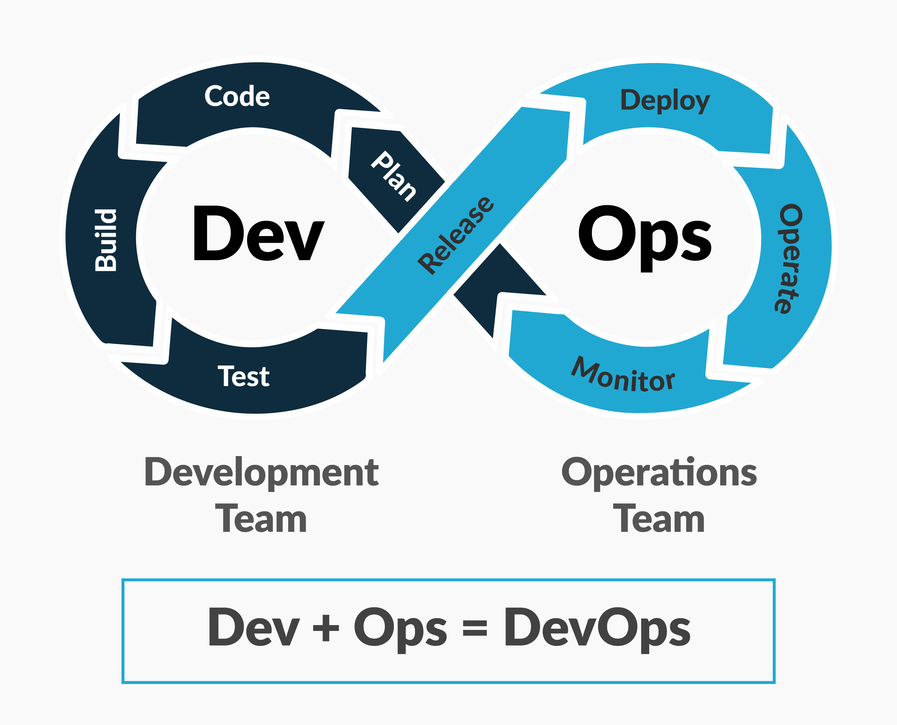
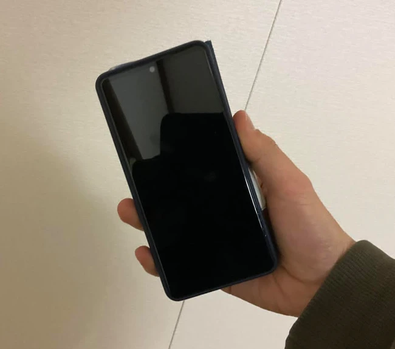
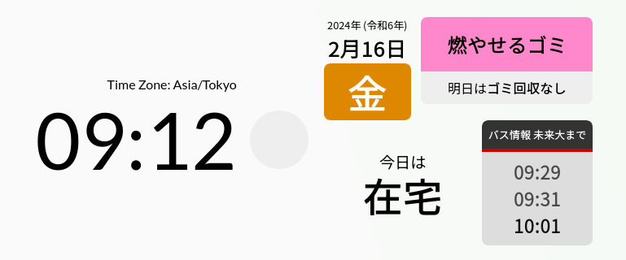
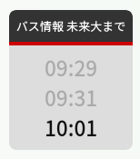
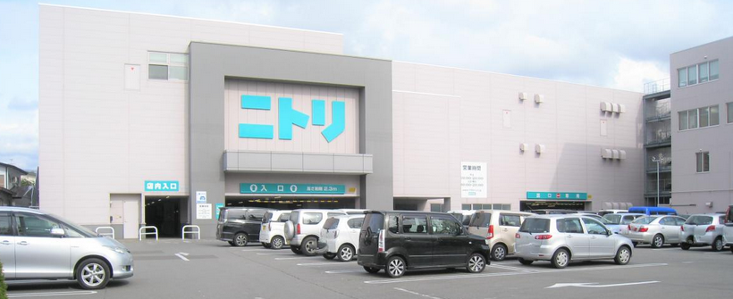
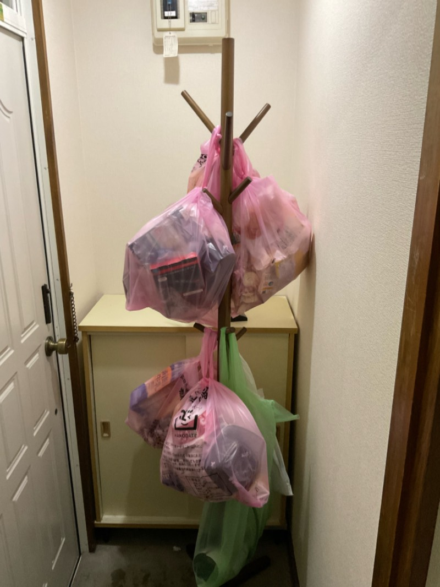

# 我が家のゴミ・Ops

公立はこだて未来大学 システム情報科学部 2年
多田 瑛貴 ただ てるき

---

# ごみ、ちゃんと捨ててる？

---

# ごみ捨てのギャンブル化
 

「家がペットボトルで
　　　埋もれてしまった」
&emsp;↓
「今日はなんの日かな」
&emsp;↓
「ペットボトル2週間後で草」

---

# ごみは捨てよう

ごみが捨てられないから
開発も上手くいかないんじゃないですか

---

# けど、面倒くさい

捨てられない言い訳なんかいくらでもできる

「カレンダーを貼れ」→ プリンターがないんですよ
「気づいたときに捨てにいけ」→ 時間ないんですよ
「毎朝8時はカレンダーを確認しろ」→ 起きれるわけないじゃん

---

# じゃあ、自動化しよう

---

# 我が家のゴミ・Ops

*写真: https://k21academy.com/amazon-web-services/aws-devops/aws-certified-devops-professional-day-2-q-a-review/*

---

# 調査

---

# 要件1: スペースの確保

ごみは和室に置いてある
*洋室 (キッチンもある場所) に置くのはあまり好ましくない*
→ ごみを捨てるときの動線にない、その気にならないと捨てられない

「ついでに捨てる」の習慣化の実現のためにも
**ごみを溜める場所は、外出までの動線にあってほしい**

---

# 要件2: カレンダーの導入

ごみカレンダーは貼っておきたい、けど
そもそもプリンターがない、あっても定期的に更新がいるから面倒

サイネージのようにして、自動で更新してくれるといい

---

# これ使えるじゃん

*1年前に洗濯機にガシャンコし　使えなくなったはずのスマホ*

---

# こんなものを開発

---

---

# 技術要件
 right:40% w:550

URL: https://home-signage.pages.dev

Vite+React+TypeScript
Cloudfare Pagesでホスト
PWAとして動作可能

サイネージ前の動くものを認識
手を振れば、画面が表示される

これなら、玄関先にも置いて置ける

---

# サイネージの副効果

開発次第で別の情報を挿入できる

そこで、バスの時刻情報も挿入
雪の時期にもバスに遅れることなく準備できる
→ **遅刻Ops**を実現

---

# でも、サイネージだけでは解決しない

サイネージの置き場所

- 洋室(玄関近く)に置く: ゴミは和室にある、結局めんどくささは変わらない
- 和室に置く: 外出時の動線から外れ、使い勝手が悪い

---

そこで

---

---

### 木を植えています 私達はニトリです

お、じゃあ俺も植えるか！

---

# 早速、木を導入

*本当は、もう少しまともな使われ方をして幸せに過ごしたかったのかもしれない木*

---

# 植樹

---

# 使い方

服のようにゴミ袋を引っ掛ける

ゴミツリーは狭い空間にも
生やすことが可能

ゴミの溜め場所の新しい選択肢として
**玄関** にも置けるように

---

# 想定される流れ

1. 外出を試みる
2. サイネージでカレンダーを確認
3. ゴミツリーからゴミ袋を取り出す
4. ゴミを捨てる

**すべてが玄関近くで完結するように**

---

# ゴミ捨てまでの流れができた！
これなら習慣化できそう？

---

# でも、これでも課題がまだある

ゴミはまだ、いくらでも溜められてしまう

ゴミ捨てのめんどくささは、どこまでいっても残る
→ 結局溜まるだけでは？？？

---

# そこで、天然のIoTパワー

時間が立つと臭気で知らせてくれる

**有機センサ** 搭載

*空間が狭いので十分機能する*

*最低*

---

# 結果

---

# ゴミ捨てまでの流れ

1. 外出を試みる
2. サイネージでカレンダーを確認
3. ゴミツリーからゴミ袋を取り出す
溜まりすぎていると、有機センサが知らせてくれる
4. ゴミを捨てる

---

引きこもらない限りはしっかり機能する
**実質、自動化できた！**

---

# 我が家のゴミ・Ops

