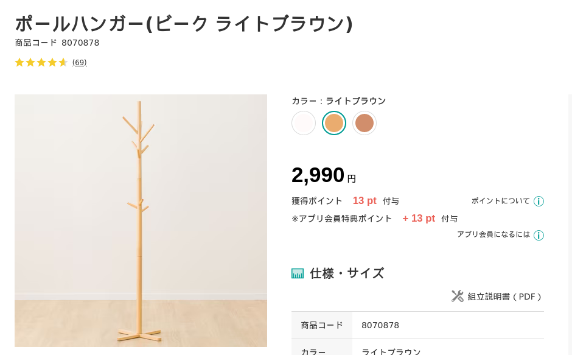

# 我が家のゴミ・Ops

公立はこだて未来大学 システム情報科学部 2年
多田 瑛貴 ただ てるき

---

# ごみ、ちゃんと捨ててる？

---

# ごみ捨てのギャンブル化
 

「家がペットボトルで埋もれてしまった」
&emsp;↓
「今日はなんの日かな」
&emsp;↓
「ペットボトル2週間後で草」

---

# ごみは捨てよう

ごみが捨てられないから
開発も上手くいかないんじゃないですか

---

# けど、面倒くさい

捨てられない言い訳なんかいくらでもできる

「カレンダーを貼れ」→ プリンターがないんですよ
「気づいたときに捨てにいけ」→ 時間ないんですよ
「毎朝8時はカレンダーを確認しろ」→ 起きれるわけないじゃないですか

---

# じゃあ、自動化しよう

---

# 我が家のゴミ・Ops

*写真: https://k21academy.com/amazon-web-services/aws-devops/aws-certified-devops-professional-day-2-q-a-review/*

---

# 調査

---

# 要件1: スペースの確保

ごみは和室に置いてある
*洋室 (キッチンもある場所) に置くのはあまり好ましくない*
→ ごみを捨てるときの動線にない、その気にならないと捨てられない

「ついでに捨てる」の習慣化の実現のためにも
**ごみを溜める場所は、外出までの動線にあってほしい**

---

# 要件2: カレンダーの導入

ごみカレンダーは貼っておきたい、けど
そもそもプリンターがない、あっても定期的に更新がいるから面倒

サイネージを導入できないものかしら

---

# これ使えるじゃん

*1年前に洗濯機にガシャンコし　使えなくなったはずのスマホ*

---

# こんなものを開発

---

# 技術要件

URL: https://home-signage.pages.dev

Vite+React+TypeScript
Cloudfare Pagesでホスト
PWAとして動作可能

サイネージ前の動くものを認識
手を振れば、画面が表示される

これなら、玄関先にも置いて置ける

---

# サイネージの副効果

開発次第で別の情報を挿入できる

そこで、バスの時刻情報も挿入
雪の時期にもバスに遅れることなく準備できる
→ **遅刻Ops**を実現

---

# でも、サイネージだけでは解決しない

サイネージの置き場所

- 洋室(玄関近く)に置く: ゴミは和室にある、結局めんどくささは変わらない
- 和室に置く: 外出時の動線から外れ、使い勝手が悪い

---

そこで

---

## 木を植えています 私たちはニトリです

---

### お、じゃあ俺も植えるか！

---

# 早速、木を導入

*本当は、女子大生の服をかけて幸せに過ごしたかったのかもしれない木*

---

# 植樹

---

# 使い方

服のようにゴミ袋を引っ掛ける

ゴミツリーは狭い空間にも生やすことが可能

ゴミの溜め場所の新しい選択肢として
**玄関** にも置けるように

---

# 想定される流れ

1. 外出を試みる
2. サイネージでカレンダーを確認
3. ゴミツリーからゴミ袋を取り出す
4. ゴミを捨てる

**すべてが玄関近くで完結するように**

---

# ゴミ捨てまでの流れができた！
これなら習慣化できそう？

---

# でも、これでも課題がまだある

ゴミはまだ、いくらでも溜められてしまう

ゴミ捨てのめんどくささは、どこまでいっても残る
→ 結局溜まるだけでは？？？

---

# そこで、天然のIoTパワー

時間が立つと臭気で知らせてくれる

**有機センサ** 搭載

*空間が狭いので十分機能する*

---

# ゴミ捨てまでの流れ

1. 外出を試みる
2. サイネージでカレンダーを確認
3. ゴミツリーからゴミ袋を取り出す
溜まりすぎていると、有機センサが知らせてくれる
4. ゴミを捨てる

引きこもらない限りはしっかり機能する
**実質、自動化できた！**

---

# 結論

カレンダーを貼ればいい

