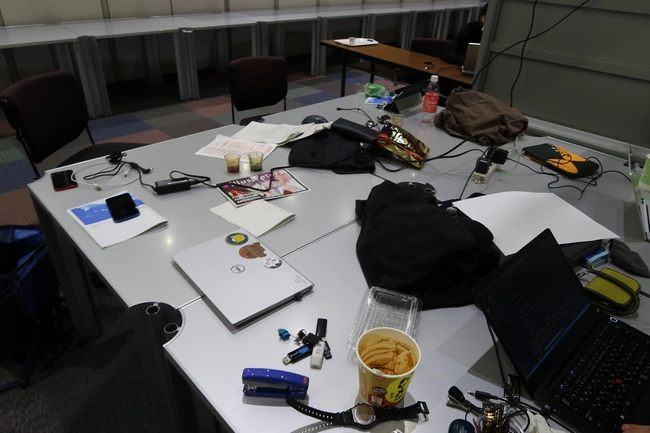
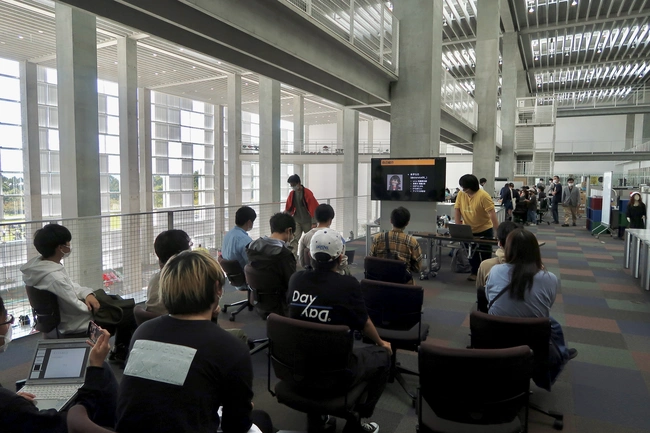
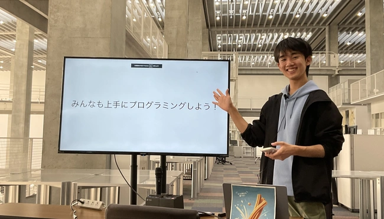
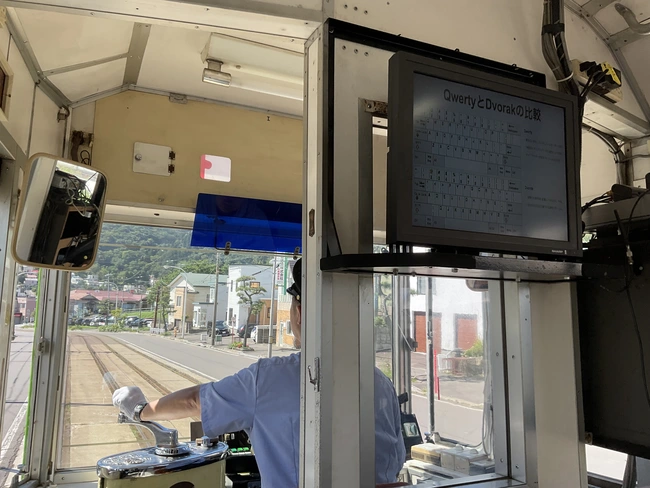
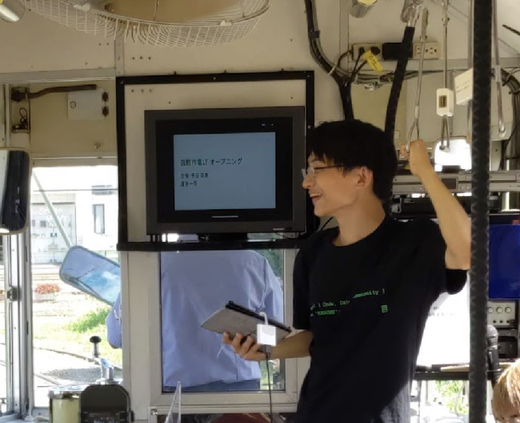

# はこだて未来大へようこそ

公立はこだて未来大学 システム情報科学部 2年
多田 瑛貴 ただ てるき

---

# 自己紹介

**多田 瑛貴** (ただ てるき)

X: @PerukiFUN
Misskey: @peruki@misskey.peruki.dev

---

# 函館ってどこにある

---

---

# 未来大ってどんなところ

---

---

---

---

---

---

# 徹底比較！会津大と未来大

---

# 1. 位置

**緯度**
会津大: 37.52361 | 未来大: **41.84181**

**経度 (東経)**
会津大: 139.93778 | 未来大: **140.76694**

### 未来大の勝利

---

# 2. 番地

**会津大**
福島県会津若松市一箕町鶴賀字上居合 **90**

**未来大**
北海道函館市亀田中野町 **116** 番地2

### 未来大の勝利

---

# 3. 講義・授業 (みんなの大学情報調べ)

---

 **会津大: 4.03**

 **未来大: 4.05**

## 未来大の勝利！！！

---

## やっぱ窓の数が違ぇんだわ

---

# まとめ

未来大は面白いところです

ぜひみなさんも、函館に来てLTしにきてください
