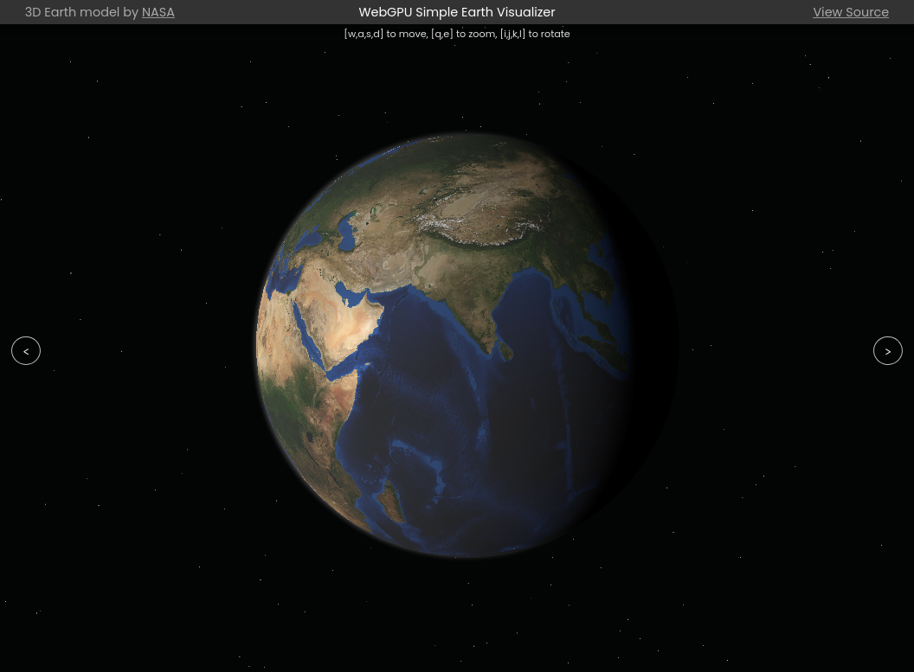
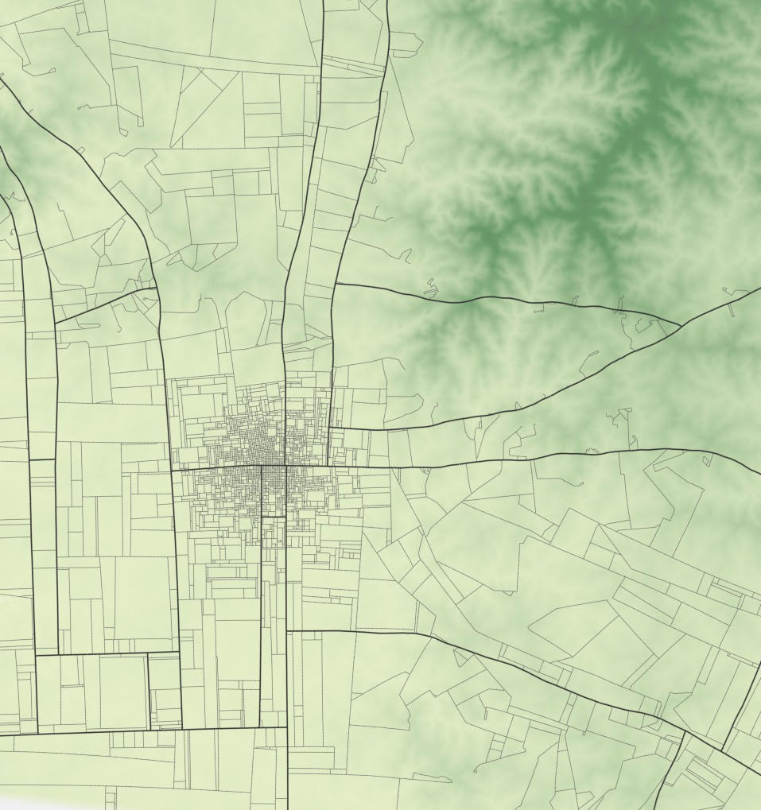
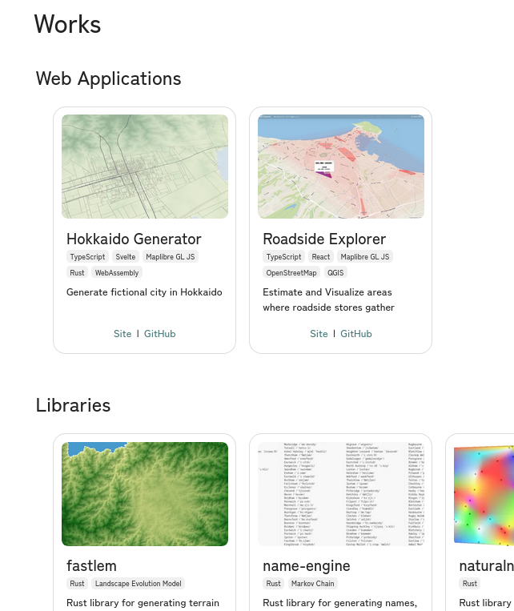
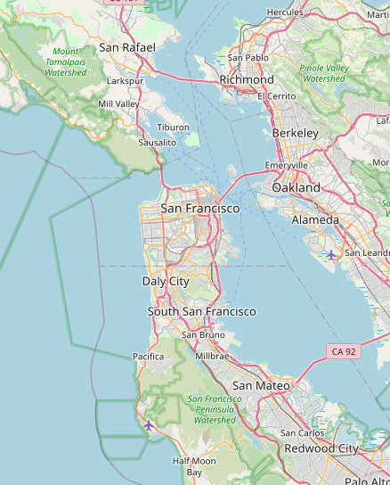
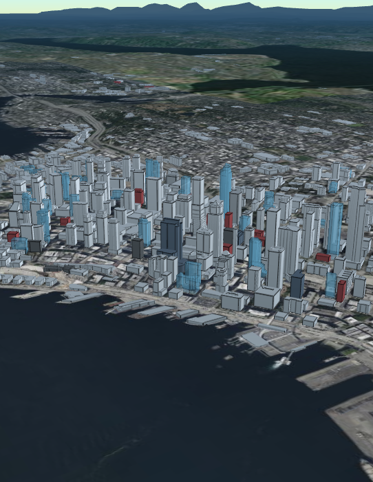
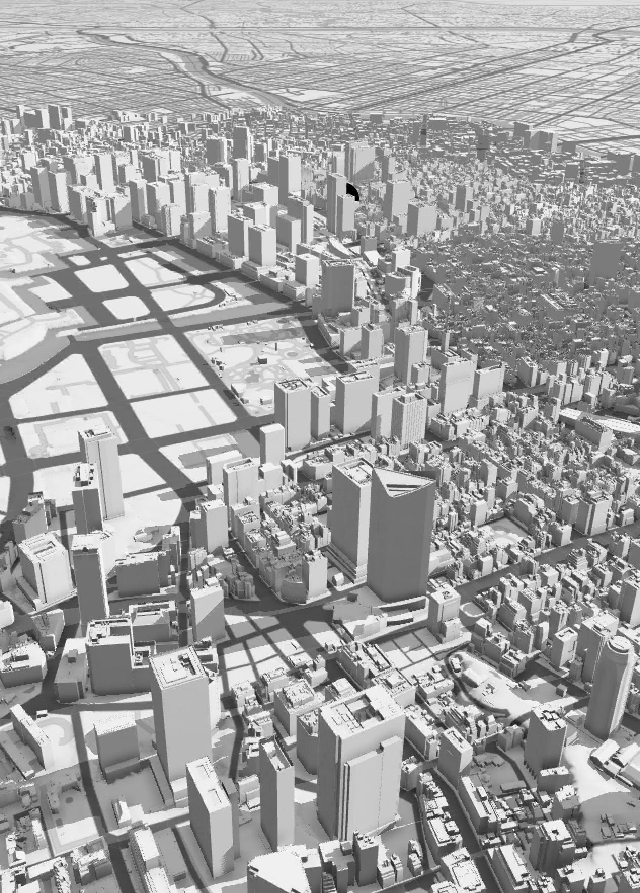

<style>
@import url('https://fonts.googleapis.com/css2?family=Noto+Sans+JP&display=swap');

footer {
    color: rgb(200, 200, 200);
    width: 100%;
}

section::after {
  color: rgb(200, 200, 200);
  content: attr(data-marpit-pagination) '/' attr(data-marpit-pagination-total);
}

:root {
  --color-back: rgb(255, 255, 255);
  --color-side: rgb(230, 250, 250);
}

section {
    background: linear-gradient(-30deg, var(--color-side) 7.5%, var(--color-back) 7.5%, var(--color-back) 94%, var(--color-side) 94%);
    background-size: cover;
    background-position: center;
    color: rgb(90, 90, 90);
    font-family: 'Noto Sans JP';
    text-decoration: none;
}

em {
    font-weight: normal;
    font-style: normal;
    font-size: smaller;
    color: rgb(130, 130, 130);
}

section h1,h2,h3,h4 {
    color: rgb(90, 130, 140);
}

section a:link {
    color: inherit;
}

</style>


# どう向き合う？WebGPUのお話

多田 瑛貴 ただ てるき
公立はこだて未来大学 複雑系知能学科 複雑系コース


---

# はじめに

Webページでグラフィックスを扱うのは面白い
- インタラクティブなコンテンツを簡単に作れる
- ネイティブなアプリケーションと違い、
  一つのコードでどのような環境でも動作する
  *開発物を気軽に共有できる*




---


# 退屈な話なので

面白いデモになるもの
いろいろ用意しています
*聞き飽きたひとはぐいぐい触ってみてください*


**https://peruki.dev/works**



---

# 今日のお話

- Webでグラフィックスってどうするの？
- 新しい標準API: WebGPUは使い物になる？どう向き合う？


---

# GPUとは

超並列処理に特化したデバイス
小さな大量のプロセッサが集まって並列に計算する

- 3Dグラフィックス
*大量にある3Dモデルの頂点・ピクセルごとに計算を行う必要がある
ゲーム用途などのリアルタイムグラフィックだと、逐次処理ではまず間に合わない*
- 科学技術計算
*行列計算など、大量のデータを同時に処理することが
求められる場合がある*

---

# GPUプログラミングについて

CPUで定義された命令を、GPUに送って実行する

3Dグラフィックスにおいては、GPUで並列に動かしてほしい処理を
**シェーディング言語** を用いて記述することがほとんど

*例: GLSL, WGSL*

*科学技術計算では、CUDAやOpenMPなどを用いて
C言語等のみでGPUを扱うことができる
環境によってはシェーディング言語を使う場合もある*

*Unity等のゲームエンジンでは、ノードベースでより簡単に扱うことができる*

---

# シェーディング言語の例

*https://github.com/TadaTeruki/webgpu-simple-earth/blob/main/graphics/src/shader/sun.wgsl*

三角形の面に対して
各ピクセルについて計算し
太陽のような星の描画を行うシェーダー
*中央からの距離に応じて透明度を変えている*
*for文を使ってピクセルを指定していないことに注目*


---

WebGPUとは...の前に

# WebGPUって...

なんとなく...

「WebでGPUが使える？」
「いい感じのグラフィックスが描ける？」

今は置いておくとして...

---

# Webのグラフィックスについて

ブラウザへの描画操作は標準化され、同じJavaScriptコードであれば
ブラウザに関係なく同じ描画ができるようになっている

*例: 「四角形を描く」(Canvas)*
`ctx.fillRect(10, 10, 150, 100);`

*例: 「色を指定する」(Canvas)*
`ctx.fillStyle = "green";`

---

# Webのグラフィックスにも三種三様
標準化されている描画方法は、新しい順に次のようになる

- **Canvas**
- **WebGL**
- **WebGPU**

*ここでは、Three.jsやD3.jsのように、ブラウザの標準仕様とされていない上位のライブラリは除外*

---

# Webのグラフィックスにも三種三様
標準化されている描画方法は、新しい順に次のようになる

- **Canvas**
- **WebGL**
- *WebGPU*

一旦、最も新しいWebGPU以外を見てみる

---

# Canvas

最もシンプルかつ古典的な描画方法
ほとんどのWebブラウザで問題なく動作する

- 2D描画のみ
- シンプルに使用可能



*参考: Leaflet.jsによるサンフランシスコの地図*

---

# Canvasを使うには

以下コードでは、緑色の四角形を描画
*コンテキストの取得は省略*
```javascript
ctx.fillStyle = "green";
ctx.fillRect(10, 10, 150, 100);
```

*参考: https://developer.mozilla.org/ja/docs/Web/API/Canvas_API*

直接APIを叩いても簡単に扱える


---

# Canvasの懸念点

表現力に限界がある
- 3D描画には対応していない
 *力づくでできたとしても、GPUを使わないため描画パフォーマンスが悪い*

---

# WebGL (WebGL 2)

Canvasの範疇では難しかった描画機能を提供
- **GPU**の利用
- 3D描画も可能

描画パフォーマンス・表現力ともに向上
*各種上位描画ライブラリでも、WebGL以前・以後のフレームワークで扱いが大別されることが多い*

*参考: CesiumJSによるサンフランシスコの3D描画*



---

# WebGLを使うには

WebGLは低レベルなAPI *描画操作というよりも、ハードウェアの操作に近い*

Canvasのように「四角形を描く」「色を指定する」などの機能が
直接提供されるわけではない

*JSだけでなくシェーディング言語も扱う必要があるなど、学習・開発・検証コストともに高い*

---

# WebGLの位置づけ

基本的に、WebGLは高位のライブラリを通して扱われる想定
- Three.js / Babylon.js  etc.. (汎用3D描画)
- D3.js / CesiumJS etc.. (特定用途向け)
*一般的な用途であれば表現力が損なわれることもない*


---

# じゃあ、WebGPUって..

WebGL自体も、GPUを使ってグラフィックスを扱える

「WebGPU」を仕様として設ける必要があるのか？

---

# WebGLの懸念点

WebGLの仕様は、既存の古い設計の流用である
*OpenGLの機能をそのままWebに持ち込んだもの*
- ステートフルである
*コードベースの巨大化に耐え難くなる・並列化に限界があるなど
  全体的にデメリットの多い設計となっている*

WebGLはGPUへの操作ではなく、あくまでグラフィックスの機能を提供する
- WebGLの提供する機能以上の細かな最適化はできない
- 描画用途以外のGPUの使用 (汎用計算) には向かない *機能としてはある*


---

# WebGPU

WebからGPUの機能にアクセスするためのAPI
- 新しい設計
  *WebGLの問題点を解消するために設計されている*
- 描画操作というよりもハードウェアの操作に近い
    *扱う事自体はより難しくなった*
    *抽象度が低い分、パフォーマンスを大いに引き出せる余地がある*
- 汎用計算へのサポート



*参考: PLATEAU VIEWによる東京都の3Dデータ描画*

---

# WebGPUを試してみる

**https://webgpu-simple-earth.peruki.dev**


---

# WebGPUの課題(1)

ご覧のとおり、現状ほとんどのデバイスで動作しない
*Chromeのみ先行している状態*

2024年時点では、単体でまだ実用的なAPIとは言い難い

---

# WebGPUの課題(2)

- WebGLと比べて、さらに細かな記述が求められる
 *よく理解して用いなければ、パフォーマンスもWebGLより悪くなる可能性がある*
- 表現力自体はWebGLと変わらない


あくまで、**上位のグラフィックスライブラリの改善が主な目的**であり
自分たちがWebGPUを意識する必要はない
*WebGPUをサポートしない環境下では、代わりにWebGLを使って
同じ描画を行うようにライブラリが自動的に切り替えてくれる*

---

# トピック

---

# WebGPUはWebブラウザの中だけでない？

**wgpu** メジャーリリース (22.0)

**https://wgpu.rs**

WebGPUを、Webだけでなくネイティブも含めた
クロスプラットホームのグラフィックスAPIとして機能させる試み
*Direct3D, Metal, Vulkan等、別系統で進化してきたグラフィックスAPIが
時代に合わせ、相互に仕様が似てきた*
*WebGPUの現時点の主戦場は、もはやWeb上ではないかもしれない*
ブラウザのレンダリングエンジンでの応用が期待される


---

# まとめ

- GPUは超並列処理に特化したデバイス
*CPUとプログラミングの方針が異なる*
- WebGPUはWebGLに変わる新しいグラフィックスAPI
*汎用計算にも対応する*
- Webでグラフィックスを扱うのに、普段自分たちが
  WebGPUやWebGLのことを意識する必要はない
*Three.jsやD3.jsなどのライブラリがよしなにやってくれる*
- 触ってみるとロマンがある
*高専でもぜひやってみよう*

---

# WebGPUで参考となる文献 (入門編)

**WebGPU Explainer**: https://gpuweb.github.io/gpuweb/explainer/
WebGPUの経緯、登場する概念、シェーディング言語の解説を
(W3Cの勧告を噛み砕く形で) まとめている

**WebGPU Fundamentals**: https://webgpufundamentals.org/
WebGPUの概要に加え、チュートリアルを提供する
手を動かして学ぶのに適している

**MDN Web Docs**: https://developer.mozilla.org/en-US/docs/Web/API/WebGPU_API
WebGPUのAPIリファレンス
実装のときに役立つが、ドキュメントとしては揃いきっていない模様

---

# WebGPUで参考となる文献 (応用編)

**WebGPU Best Practices**: https://toji.dev/webgpu-best-practices/
綺麗に書き、かつ性能をフルに引き出すためのベストプラクティスをまとめている
中身の振る舞いの理解にも役立つ、はず (読んでいる途中...)
