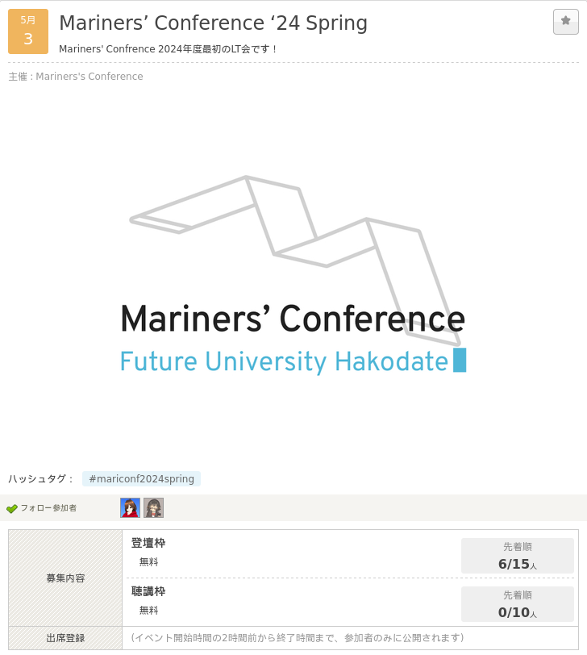

# Mariners' Conference 自己紹介LT クロージング

---

# みなさん、お疲れ様でした！

---

# 確認: 入部までの流れ

入部を希望する方
Google Formsに入力して下さい
*検討中の方はまだ大丈夫*

**https://forms.gle/DaNCBXvedvCiAExx7**

---

# 次回の予定

**2024 Spring LT**

日時: **5/3 (日)** 13:30~
会場: **亀田交流プラザ** 大講義室

今からも参加申込可能です！

---

# それでは、ありがとうございました！