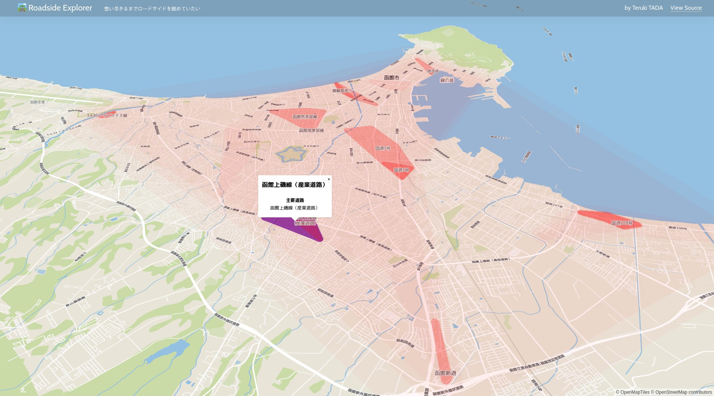

# 自己紹介LT

Mariners' Conference ミニLT 
多田 瑛貴 ただ てるき

---

# 多田 瑛貴 について

出身: 福山 *(広島県)* → 京都 *(18年)* → 函館

所属: 複雑系知能学科 複雑系コース 新3年

 
Mariners' Conference 設立 & 部長
 

---

未来大に来てから...
# 今まで作ったものをまとめてみよう

---

# 前提: 地図は素晴らしい

多田 瑛貴は基本的に講義を聞いていない

だって

地図は見ていて楽しい

---

# 松屋 vs 西松屋

**[matsuyanishimatsuya.pages.dev](https://matsuyanishimatsuya.pages.dev)**

地図上のランダムな範囲から
松屋と西松屋の店舗数の多い方を当てるゲーム

---

# Roadside Explorer

**[roadside-explorer.peruki.dev](https://roadside-explorer.peruki.dev)**

全国のロードサイト店舗の集まる地域を
推測し、可視化するWeb地図

---

地図を眺めているだけでは飽き足らず

---

# 地形生成

**[fastlem.peruki.dev](https://fastlem.peruki.dev/)**

いい感じの地形を生成する

地形学の数理モデルを適用し
侵食作用をシミュレーション

---

# なぜこんなことを？

昔、架空地図を描いていた

大きな作品を作るには
途方もない時間がかかる
*三日坊主な自分には限界ある*

---

作業を効率化する
ツールの作成を目指したのが始まり
*結局、**全部生成してしまえ**の気持ちに*

---

# 目標

地形・地名・都市モデルを生成

**世界地図ごと生成させてしまおう**

*欲をいうならSIGGRAPHとかに出したい*

---

---

---

# 技術でできること

シミュレーション実装が多い

表現の道具として、Web技術も *Reactが多め*

- 最近よくやる言語: **Rust**, **TypeScript**
- その他やってた言語: **Go**, **JavaScript**, Python, C/C++

---

# 宣伝

4/29 **NT函館**

5/3 **Mariners’ Conference ‘24 Spring**

きてね

---

# 自己紹介LT

Mariners' Conference ミニLT 
多田 瑛貴 ただ てるき

