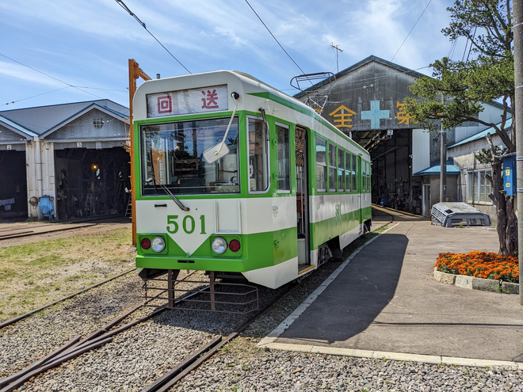

# Mariners' Conference

**サークル紹介** for Miraive OFFLINE 2024

多田 瑛貴 Teruki TADA

---

# みなさん、ご入学おめでとうございます🌸

---

# Mariners' Conference 概要

通称: **マリカン**

**LTイベント**を主軸として
技術分野における幅広いイベントの
開催・参加・支援を行う
技術系サークル

*結成: 2022年2月*
*公認サークル登録: 2023年4月*

---

# LTイベント？

**LT (=ライトニング・トーク)とは...**

技術系のトピックを中心に、自分の好きなテーマや関心事について
5~10分程度のプレゼンテーション形式で発表する交流会

*エンジニア業界を中心に、広く浸透している文化*
*自分の学んだことや面白いことを、気軽にアウトプット・議論できる良い機会です*

---

# 雰囲気

---

---

---

---

---

# 毎年の活動

---

## Mariners' Conference Spring LT

4-5月頃に行われるLT会
未来大新入生の歓迎を兼ねたイベントです

---

## Mariners' Conference 未来祭LT
10月頃に行われるLT会
はこだて未来大の学園祭
未来祭内で行われます

---

# 不定期の活動

---

## 函館市電LT 

函館市電を貸し切ってLTをします
*札幌や旭川、東京など遠方からも参加者が！*

---

## 技術書典

技術同人誌を出版・販売します

*毎年秋に参加しています*

---

# 他大学との交流

他大学のLTサークルとも合同でイベントを開きます

### 参考事例

- **CIST IT COMMUNITY** (千歳科学技術大)
- **UN-FROZEN** (筑波技術大)
- **Zli** (会津大学)

---

# サークル費について

加入のみであれば**徴収なし**

イベントごとに**参加費**を徴収する形式

### 参考事例
 - 2023 Spring LT: **500円**
 - 市電LT: **2500円**
 - 2023 未来祭LT: **無料**
 - 2024 Spring LT(予定): **無料**

---

# サークルの文化

未来大生と函館のためのオープンな技術コミュニティ

 - あらゆる立場の受け入れ
*基本的に未来大生を対象としつつも、*
*中高生や社会人、地域内外の人など、さまざまな人に向けて開放*

 - 非営利な活動の推進
*非営利な活動を主軸にすることで、開放的な活動の枠組みを実現*

 - 活動の積極的なアーカイブ
*サークルの管理、および活動の企画運営のために作成された*
*議事録等のドキュメントは、誰でも閲覧可能な状態で公開*

--- 

# Mariners' Conferenceの活動について

基本的にMariners' Conferenceの運営するイベントは
部員以外の方も参加・企画運営が可能です

--- 
# サークルに加入するメリット

以下のようなメリットがあります

 - "Mariners' Conference主催" として
イベント・勉強会などの企画進行
 *広報や費用面などの支援を積極的に行います*
 - 部室・共用サーバーの利用
 - Mariners’ Conferenceメンバーとして
    外部イベントの参加 (技術書典など)

*サークル費は徴収しません*

---

# イベント予定

---

## 2024 Spring LT

日時: **5/3 (日)** 13:30~
会場: **亀田交流プラザ** 大講義室

今からも参加申込可能です！

---

## 新歓LT？

日時: これから決めます
会場: 未来大学構内

自己紹介などを中心に行います

技術についてまだ知らない・これから学びたい方も是非どうぞ！

---

# よろしくお願いします！

**X**: @mariconf_fun

情報共有など**Discord**にご参加下さい！**→**
*サークルに加入していなくても参加できます*

