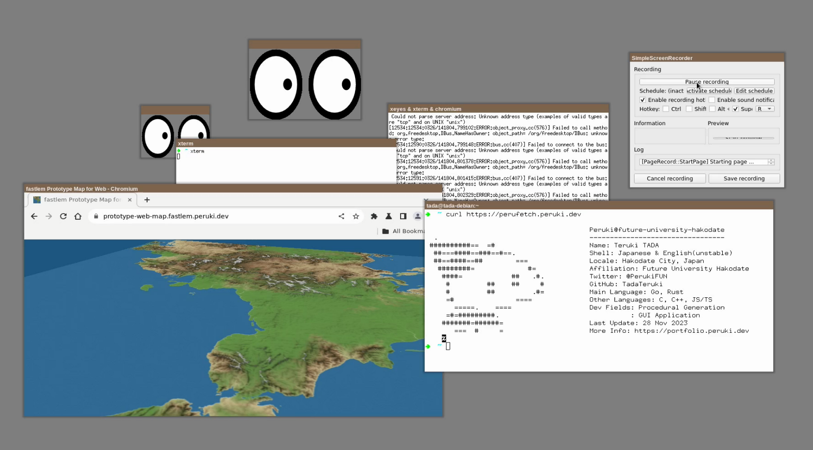
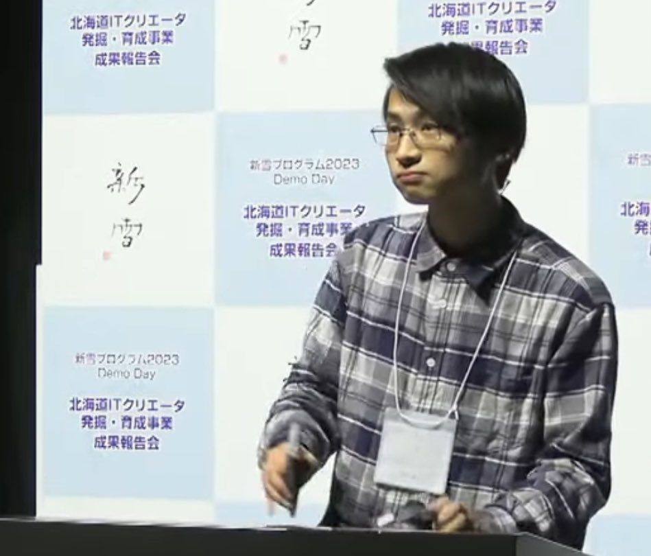
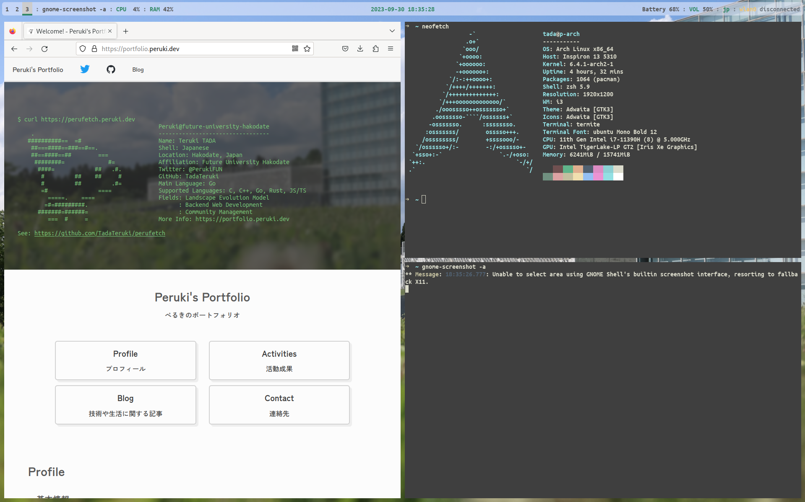
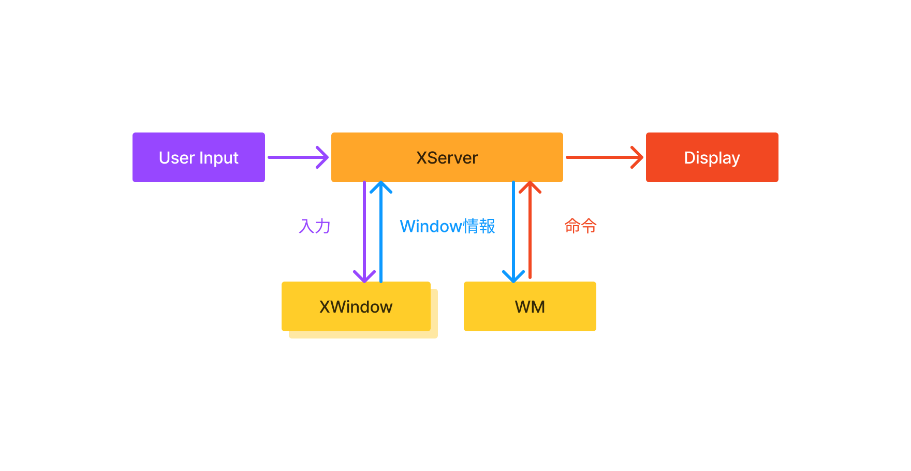
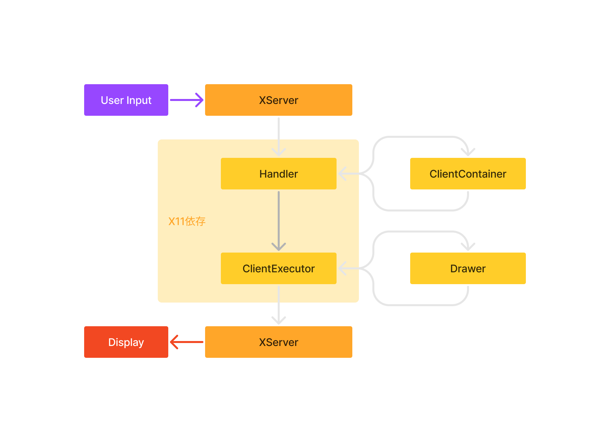
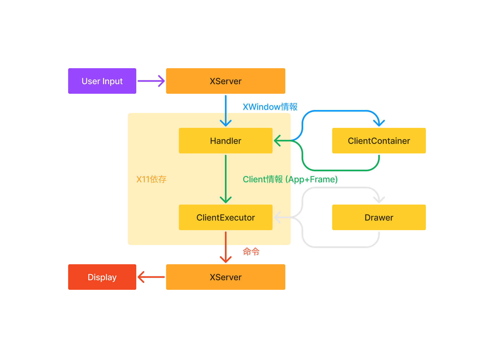
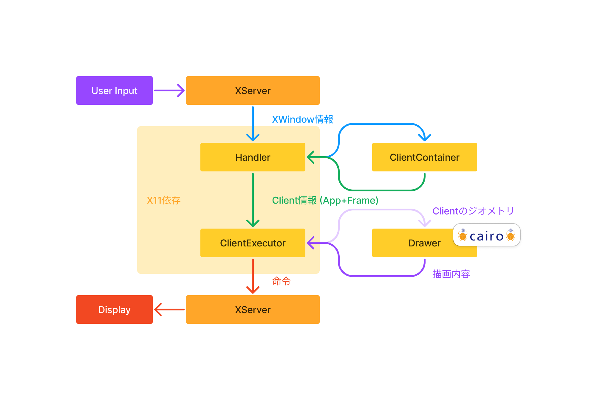
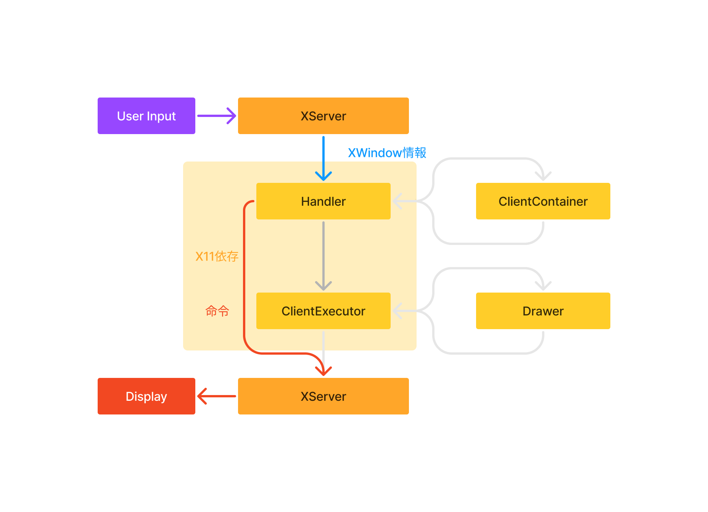
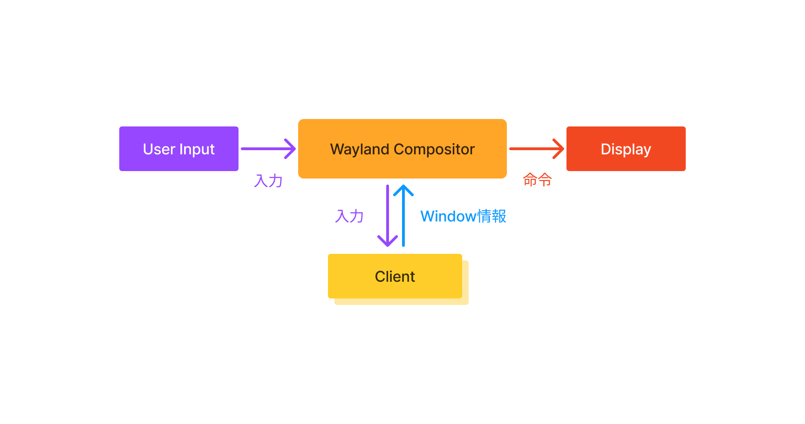

*サイボウズ・ラボユース 成果発表会 (第13期)*

Linuxウインドウマネージャ開発を通じた
# 良い設計へのアプローチ

多田 瑛貴 Teruki TADA
*システムソフトウェア研究開発 (星野ゼミ)*

---

# 自己紹介

**多田 瑛貴** Teruki TADA

- 公立はこだて未来大学
システム情報科学部 2年

- 地図・FLOSS・グラフィックス

---

# ウインドウマネージャ (WM)

コンピュータのGUI環境上で

- ウィンドウの表示・非表示
- 位置関係
- 前後関係

などの管理を行うソフトウェア

*参考: Window manager - ArchWiki*
*https://wiki.archlinux.org/title/Window_manager*

---

# 成果物デモ

良い設計を目指したWMの実装

(現在も開発中)

https://storage.googleapis.com/misskey-tadateruki-main/misskey-tadateruki-main/8d92d5b8-3875-4769-90a1-41286d1fe048.mp4

---

# プロジェクトの背景

- LinuxのGUI環境のメジャーな基盤となっている
  X11プロトコルは、仕様が古く
  そのアーキテクチャに様々な問題点や指摘されている

*X11に対する指摘の例: Gajewska, Hania et al. “Why X is not our ideal window system.” Software: Practice and Experience 20 (1990): n. pag.*

---

# プロジェクトの内容と目的

WM開発を通して、適切なソフトウェア設計について議論

現代の主要なユースケースを軸とし
保守性・可用性・拡張性に優れた
モデルケース的なWMを開発する

*言語はRustを選定*
*メモリ安全性や処理速度に優れているほか*
*ポリモーフィズムを取り入れた設計が適用可能*

---

# X11プロトコルの全体像

---

# X11プロトコルの全体像

X11はクライアント・サーバーモデル

1. 入力 (イベント) をXServerが受け取る
2. 対象となるXWindowの情報を取得
3. WMにXWindowの情報とイベントを渡す
4. WMからXServerに対象の操作を指示し、デスクトップを更新

*XWindow: X11におけるウインドウ*

---

---

# X11 WM開発における課題

1. XServerとWMとの**状態の分離** 
2. **X11環境への依存**

---

# 課題1: 状態の分離

位置・大きさ・前後関係等など
ウインドウの状態は**XServer側**が持つが

それらを操作するのは**WM側**

---

# 課題1: 状態の分離

操作のたびに、状態の取得や変更のための通信が発生

**キャッシュをしない場合**
冗長な通信によるパフォーマンス低下

**キャッシュをする場合**
状態が複製され、変更時に整合性が取れない場合がある

---

# 課題1: 状態の分離

本プロジェクトにおいては、リモート操作を
ユースケースとして考慮しないこととし
**原則キャッシュをせず、常に問い合わせる** 判断を行った

 - キャッシュ寿命の管理など、構造の複雑化が予想される
 - ローカルで動くことだけを考えれば、通信負担はほぼ無視できる

*これは、WMのユースケースに強く依存*
*X11Forwardingでのリモート操作をサポートする場合は再検討の必要あり*

---

# 課題2: X11環境への依存

X11に依存する処理を分離したい

 1. **テスタビリティ**
    基本、GUIの実環境でしかテストできない
    テスト自動化が難しく、効率が悪い・動作ケースを網羅できない
 1. **他環境への移植性**
    X11以外の環境でも、少ない実装の変更で対応できると良い

---

# 課題2: X11環境への依存

**テスタビリティ** について

議論の末、以下の処理を分離することに

1. **ウインドウの位置・大きさの計算**
   タイトルバーとアプリケーションの同期をはじめ
   整合性の求められる部分をカプセル化
   *X11では、タイトルバーも独立したXWindow*

2. **装飾の描画内容**
   描画機能を別ライブラリに委譲 (Cairo)
    ウインドウに描画する代わりに、画像で出力して確認 *(現在未実装)*
    *GUI操作はX11の機能に依存するため、基本的には分離不可能*

---

# 課題2: X11環境への依存

**他環境への移植性** について

X11とそれ以外で、ソフトウェアのモデルが大きく変わる
抽象化できる層が薄く、メリットを得られない

よって、この点は考慮しないことに

*X11の問題点の多くは、そもそもX11のモデル自体に起因している*

---

# 開発物の全体像

ここでは
アプリケーションのXwindow (App) + タイトルバー等装飾用のXWindow (Frame) 
を組み合わせたオブジェクトを「**Client**」として扱う

1. イベントを受け取る **Handler**
1. XWindowのidからClientを問い合わせる **ClientContainer**
1. Client単位で命令を作成する **ClientExecutor**
1. Frameの描画内容を定義する **Drawer**

---

全体像

---

Clientに関する
イベントの処理

---

Clientの描画時

---

Clientとして
扱われない
XWindowの処理

---

# まとめ

- X11プロトコルを用いたWM開発において
  状態の分離とX11環境への依存が課題

  WMの主要なユースケースに合わせ
  状態の整合性とテスタビリティを優先した設計を行った

- 現在も開発継続中である

---

# Waylandプロトコルによる解決

Waylandプロトコルでは、XServerとWMにあたる部分が
**Compositor**として一体化されている

よりシンプルなモデルで、状態の分離を解決

---

---

# Waylandプロトコルによる解決

ただし、今までXServer (Xorg) が抽象化していた
ハードウェアを扱う処理も同時に担うため、開発が困難である

本プロジェクトでは、現状扱わないが
今後の課題として、Waylandの場合での設計を議論したい