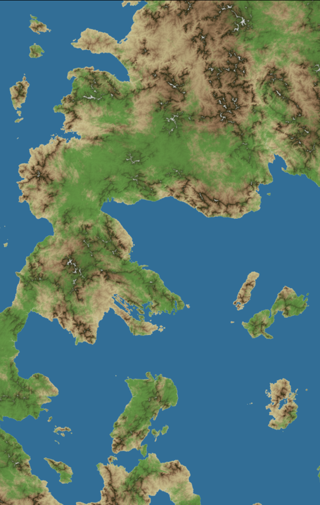
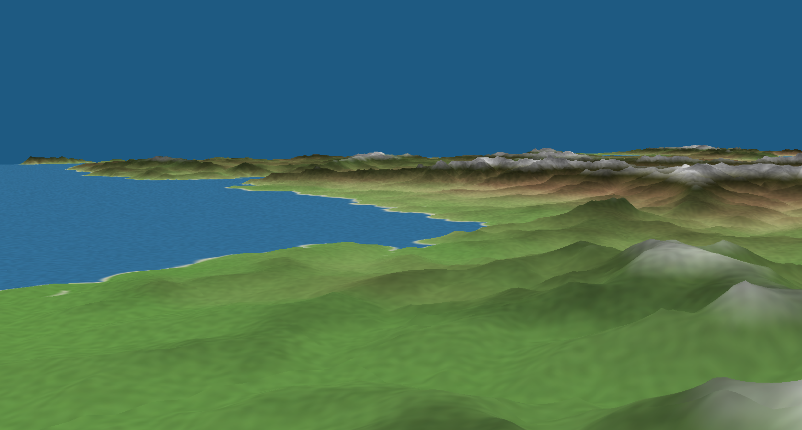

**ゲーム・映像表現の可能性を広げる**
# 地形生成ライブラリの開発

多田 瑛貴 Teruki TADA
*公立はこだて未来大学 システム情報科学部*

---

# 地形生成について

コンピュータによる地形生成は
Minecraftをはじめ多くのゲームで実装されている

*(写真) 上: MineCraft、下: OpenTTD*

---

# プロジェクトの動機

**地形学の数理モデルを取り入れた**
**汎用性の高いオープンな地形生成ソフトウェア**

---

# 地形生成について

特殊なノイズ (パーリンノイズ) の
重ね合わせで生成されることが多い

----

# プロジェクトの動機

地形生成の先行事例について
それぞれの要件には即しているかもしれないが、物足りない

**よりリアルかつ雄大な**地形が生成されるのを見てみたい

---

# 雄大な地形？

---

**写真: 江差町 市街地**

---

**写真: 江差町 鴎島**

---

###### 写真: 函館市 立待岬

---

###### 写真: 北斗市上磯町

---

**写真: 斜里岳**

---

# 雄大な地形の条件

多くは、河川・氷河の侵食作用に起因

*写真: 北海道新ひだか町静内の風景と
その標高データ (出典:地理院地図)*

---

# 地形学研究における地形生成

河川・氷河の侵食作用を再現した地形生成のモデルは、既に存在

主に**地形学の研究**として研究されている

---

# 地形学研究における地形生成

地形の形成過程の分析
数理モデルを用いたシミュレーション
*例: **badlands** (https://pypi.org/project/badlands/)*
*写真は上記リンクより*

---

# 地形学研究における地形生成

パラメータが厳密であり、扱うのに専門知識が必要
実行環境も限定される (Python, MATLAB)

**ゲーム等のメディア用途には向いていない**

---

# プロジェクトの目標

**地形生成のためのソフトウェア**の開発

 - 地形学の数理モデルを導入
 - パラメータは必要最低限
 - 多くの用途・実行環境に対応

*かつ、それがオープンかつ汎用的であると嬉しい*

---

##### 成果物について

---

# 成果物デモ

**https://fastlem.peruki.dev**

---

# 成果物概要

**fastlem** - https://github.com/TadaTeruki/fastlem

プログラム言語: Rust
WebAssembly対応、JSでも実行可能

ライブラリとして、Rustプログラム上で利用

---

# 機能

**河川・氷河の侵食作用のシュミレーション**

メディア用途を想定し
地形の生成に必要なパラメータは**2つ**に絞る

*- Erodibility (侵食に対する影響の強さ)*
*- IsOutlet (海かどうか)*

---

# 実現に向けての取り組み

**数値計算のほとんどを自力実装**
*一部データ構造を除く*
 - 高速性を意識し、細かな最適化に対応

**ドキュメントおよびサンプルコードの整備**
 - 複雑な地形を生成するサンプルも整備
 *左写真: examples/terrain_generation_advanced.rs*

---

# 実行環境

**Rust**言語のプログラム上
高速かつ安全に実行可能

WebAssemblyに対応し
Webブラウザ上でも動作する
*WebAssemblyの将来性を踏まえ、拡張性を実現*

---

# 複雑な地形の生成

特殊なノイズ (パーリンノイズ) を
**地形のパラメータ**に対して適用することで
複雑な地形の生成を実現できる

*ノイズをうまく引き伸ばすことで*
*数理モデルでは扱いづらい断層やカルデラなども*
*(擬似的ではあるが) 再現できる*

---

# 作品例

Maplibre GL JSによる3D地図

**https://prototype-web-map.fastlem.peruki.dev/**

---

---

---

# 今後の目標

地形生成の目標は概ね達成

手続き的生成等に関する様々な制作物のサンドボックスに活用予定
 

手続き的に生成されたデータのみで**素敵な世界を作ってみたい**

---

*上: 拡張L-systemに基づく交通網生成*

*下: マルコフ連鎖による地名生成*

---

**ゲーム・映像表現の可能性を広げる**
# 地形生成ライブラリの開発

多田 瑛貴 Teruki TADA
 

**ありがとうございました**

